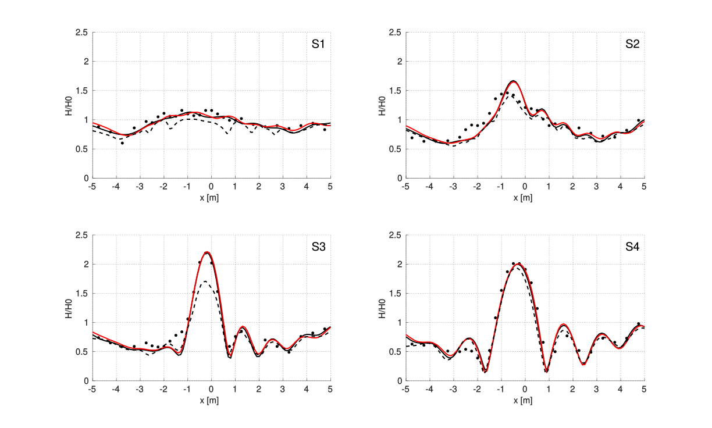

# Initial Development log

1. [Observations : Time-stepping : Predictor-Corrector](#log_bsnqM_v0001_1)
1. [Observations : Time-stepping : RK2](#log_bsnqM_v0001_2)
1. [Observations : Time-stepping : AdBaE3 [2020-10-05, 2020-10-07]](#log_bsnqM_v0001_3)
1. [Observations : Time-stepping : RK4 [2020-01-08]](#log_bsnqM_v0001_4)

## Attempting
- Making the code modular so that it can be used by many
- bsnqModule with all the required variables
- It is also required to make it easier to couple with other codes, especially such as MLPG\_R code.
- FEM analytical integrals as general functions so that they can be used later in other code. Check file *femAnalyticalTri_vx.x.f90*

## List of Work
- [x] Mesh input (Type0)
- [x] FEM Initialisations
- [x] Wave probes - nearest node based
- [x] Inlet wave characteristics
- [x] Absorbance coeffs
- [x] Mass matrices
- [x] Stationary matrix set 1
- [x] Dynamic matrix set 1
- [x] Boundary integrals
- [x] Full momentum mass matrix
- [x] Dirichlet BC
- [x] Conversion to CSR form
- [ ] Explicitly applied Neumann BC for eta
- [x] Time-stepping : RK4
- [x] Time-stepping : Adam-bashforth
- [ ] Time-stepping : Predictor Corrector - noise
- [ ] Time-stepping : RK2 - noise
- [x] WaveType class with constructor for waveLength
- [x] Paraview XML output
- [x] Improved Makefile - to reduce compilation time by grouping regular files in a header
- [x] *bsnqVars* class for storing P, Q, &eta;, totDep and time values

-----------------------------------------------

## Matrices with correct signs
- [x] Mass M1 and M2
- [x] Bs1, Bs2, Bs3, Bs4
- [x] CxF, CyF
- [x] DMat with porosity removed
- [x] Bs5, Bs6
- [x] Advection matrix with porosity removed
- [x] Hydrostatic pressure matrix

## Modular structure
- bsnqModule
    - type :: bsnqCase
      - procedure ::  initMat
      - procedure ::  meshRead
      - procedure ::  femInit
      - procedure ::  setRun
      - procedure ::  statMatrices
      - procedure ::  dynaMatrices
      - procedure ::  destructR1
    - type :: waveType
      - constructor :: waveLenCalc
- bsnqGlobVars  
    - Datatypes and constants only

-----------------------------------------------

<a name = 'log_bsnqM_v0001_4' />

## Observations : Time-stepping : RK4 [2020-01-08]
- The code was modified for RK4 time-stepping with realtive ease.
- Modifications were done to *preInstructs*, *updateSoln* and *postInstructs* functions to accomodate for RK4 time-stepping. 
- No Other changes were required and the code was verified usiing Berkhoff Shoal test case.
- RK4 is a single-step method where the equations are evaluated at intermediate steps but the information is then discarded and not used for other time-steps
- AdBaE3 is a multi-step method which utilises the information of previous time-steps for calculating the current solution
- AdBaE3 and RK4 seem to give almost identical results.
- AdBaE3 is 3 times faster than RK4 in the current implementation for the same time-step size. However a larger time-step can be used for RK4 due to its better stability.

-----------------------------------------------

<a name = 'log_bsnqM_v0001_3' />

## Observations : Time-stepping : AdBaE3
This is the same time-stepping as he old code. However I have implemented it a little differently this time given the change in the code strucutre. Also I avoid applying dirichlet boundary conditions on P&#775;, P&#775;, &eta;&#775;. I have used the *bsnqVars* class to save the solution &Delta;P, &Delta;Q and &Delta;&eta; based on the time-values that were used to calculate thise and therefore I can do any time-stepping with this structure.

The code now is stable like before. However the solution has higher amplitude than the earlier solution and I do not know yet why. It could be due to the changed mentioned here [here](#predCorNote1), mainly the 6x6 treatement of the advection term. I will try and use the old advection calculation and see if that brings the solution back to normal. 

It was also noted in this version that there is a need to force the DirichletBC. The Dirichlet type BC are applied to &Delta;P, &Delta;Q and &Delta;&eta; while solving for the system of linear equations. This however does not ensure that after time-stepping the solution would match the required Dirichlet solution. So now I am forcing the dirichlet BC. However despite me correcting this I am getting slightly higher amplitude than expected. Hopefully this is not the reason behind it, but it is possible.

### Update
I tested with the old advection term calculation and there almost no differnce in the results between the results calculated using the new *fem_N6i_du6N6jdx()* and the old *nAdvMat()*.  
Hence the new method for calculating *NAdv* is not the reason for this amplitude increase.

### Update-2
I tested with the old *Bs5* *Bs6* terms. This too is not the cause for the increased amplitude. I however testes without doing the boundary integral in that equation but I dont think thats too important.  
Hence the new method for calculating *NAdv*, *Bs5* and *Bs6* is not the reason for this amplitude increase.  
I think now that its only the inlet BC.  
Another possibility is me not applying the Neumann BC explicitly for &eta;.

### Update-3 [2019-10-05]
**The issue of higher amplitude has now been solved!**  
The reason was me not calculating the boundary integral term in the auxiliary variable *w* equation. It is zero for the *type-12* and *type-13* boundaries due to d&eta;/dn = 0 at those boundaries. However at *type-11* (inlet) and *type-14* (sponge layer with &eta;=0) we need to calculate this boundary integra;. I have introduced a static matric *gFW* which simply adds to *gDMat* hence there is only one time computation and no increase in the dynamic calculations.  
The results have been compared with the old code and its matches well with even better performance at the sponge layer than before.  

### Update-4 [2019-10-07]

     

**Fig :** Wave-heights at alone different line sections. Results from *bsnqM_v1.01* in red &mdash; Results from *bsnq_par_v7.3.3* in black &mdash;. Results from FUNWAVE in black ---. Results from experiment in black &bull;.  

The new code with AdBaE3 was tested and verified using the Berkhoff shoal test case. There is a good comparison with the earlier results and with experiments as shown above. Using a time-step of 0.005s on the i5-8300H CPU with 6 cores it takes 2 hours for 9000 time-steps. I think it is slightly faster than the earlier code because I am not running additional loop for applying the Neumann BC.  

The differences from the old code are

- Modular structure. Can eeasily modify to apply RK4 or any other time-stepping
- Boundary integrals for Bsnq terms included implicitly. Old code had them as explicit terms and was using n-th time-step values to calculate boundar integrals for solution at n+1 time step.
- Did not use Gauss divergence for Bs5 and Bs6 terms as it was unnecessary
- I have calculated the advection term assuming u = P/(h + &eta;) as 6 point variable, where I interpolate the value of (h + &eta;) at the middle nodes.
- The Neumann BC for &eta; is applied by making boundary integral in auxiliary variable eqn as zero for *type-12* and *type-13* boundaries. This boundary integral has to be calculated for the *type-11* and *type-14* boundaries otherwise it will create issues of increasing the amplitude of wave generated from inlet BC.

-----------------------------------------------

<a name = 'log_bsnqM_v0001_2' />

## Observations : Time-stepping : RK2
This too does not work! Similar problems as Predictor-corrector

In both RK2 and Predictor-corrector I was using two values for estimating the answer. In AdamBash-3-Explicit, I use 3 values. This is porbably the reason for the noise build up.

-----------------------------------------------

<a name = 'log_bsnqM_v0001_1' />

## Observations : Time-stepping : Predictor-Corrector
The predictor-corrector time-stepping had working in the GWCE (Generalised Wave Continuity) equation model pretty well as shown in Dresback(2004). We ourselves had found good results with this time-stepping in our 9-noded FEM-GWCE model, where the oscillations at lower depth and near boundaries were removed. With those results in mind, I tried to implement the algorithm in Bsnq equation. 

  

We first tested it in one-dimension with a simple Bsnq 1D equation as shown above. This was tested in a MATLAB code and found to work well for pressure source with both predictor-corrector and 3-point explicit Adam-Bashforth time-steppings. We were able to get the leading waves in case of pressure disturbances like in the paper Lee (1989). Therefore, based on this we hoped that it might give us the proper ship-generated wave pattern in 2D Bsnq too.

I wrote the code *bsnqM_v1.0.f90* under the *predCor* branch of GitHub repo <https://github.com/shagun1994/bsnq.git>. Its a stripped down code with only basic terms without any dissipation terms or extra source terms, However when I tested it for basic test case suchj as Whalin shoal, it gave me higher than usual wave-amplitudes. Even worse is that there was noise build-up over time and the code failed. Similar observation was notices for constant basthymetry cases too, for kh=0.73, 0.63 and 0.46. Check folder *Trial 21/Output_PredCor_bsnqM_v1.01/* for these results. I even tried to do multiple corrector steps but that just dampened the entire solution.

All the derivations for this are available in the notebook I bought in UK.

Therefore, I can conclude that either I didnt apply predictor-corrector properly (less-likely) or the method does not work for this equation (more-likely). Given that AdBaE3 works the latter is the more likely conclusion.

There are another two differences to keep in mind in these version:  

- I have calculated the advection term assuming u = P/(h + &eta;) as 6 point variable, where I interpolate the value of (h + &eta;) at the middle nodes.
- I have not done Gauss divergence for the *Bs5* and *Bs6* terms.

-----------------------------------------------

## References
1. Sørensen, O. R., Schäffer, H. A., & Sørensen, L. S. (2004). Boussinesq-type modelling using an unstructured finite element technique. Coastal Engineering, 50(4), 181–198. [DOI](https://doi.org/10.1016/j.coastaleng.2003.10.005)

1. Agarwal, S., Sriram, V., & Murali, K. (2019). Modelling Wave Interaction with Porous Structures Using Boussinesq Equations. In Proceedings of the Fourth International Conference in Ocean Engineering (ICOE2018) (pp. 573–583). <https://doi.org/10.1007/978-981-13-3119-0_35>

1. Dresback, K. M., Kolar, R. L., & Dietrich, J. C. (2004). A 2D implicit time-marching algorithm for shallow water models based on the generalized wave continuity equation. International Journal for Numerical Methods in Fluids, 45(3), 253–274. https://doi.org/10.1002/fld.697

1. Lee, S.-J., Yates, G. T., & Wu, T. Y. (1989). Experiments and analyses of upstream-advancing solitary waves generated by moving disturbances. Journal of Fluid Mechanics, 199(1), 569. https://doi.org/10.1017/S0022112089000492