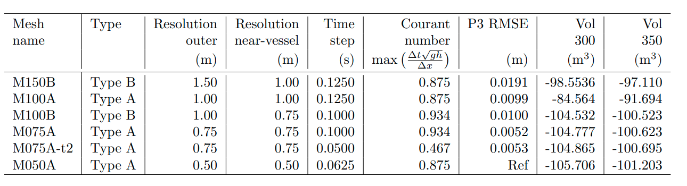

# Moving pressure field and Gradient MLS development

1. [Observations : shipPress : Pressure at lin vs quad nods](#log_bsnqM_v0002_1)
1. [Observations : shipPress : Noise compared to old code](#log_bsnqM_v0002_2)
1. [Observations : shipPress : Press2 val Linear nodes](#log_bsnqM_v0002_3)
1. [Observations : shipPress : Soliton generation](#log_bsnqM_v0002_4)
1. [Observations : gradMLS : MLS with FEM Neigh only [2020-01-30, 2020-02-03]](#log_bsnqM_v0002_5) 
1. [IMPORTANT BUG : dirichletBC [2020-02-03]](#log_bsnqM_v0002_6)
1. [IMPORTANT BUG : fem_N6i_Sc6_dN6jdx [2020-03-02]](#log_bsnqM_v0002_7)
1. [Observations : gradMLS : Neigh search - any rad FEM linktable [2020-02-27, 2020-03-06]](#log_bsnqM_v0002_8)
1. [Feature : Ship Y force and Drag calc for multiple ships [2020-09-11]](#log_bsnqM_v0002_9)
1. [Edit : Absorbing layer beyond limit length [2020-09-13]](#log_bsnqM_v0002_10)
1. [Observation : Mesh requirement for ship cases [2021-03-12] **VERY IMPORTANT**](#log_bsnqM_v0002_11)
1. [Feature : New drag calculation approach for ship [2021-03-26]](#log_bsnqM_v0002_12)
1. [Feature : Cubic Spline path for ship [2021-04-07]](#log_bsnqM_v0002_13)

## Attempting
- Add moving pressure to simulate ship-generated waves
- Calculating the gradient of quantities using mesh-free techniques
- Optimised neighbour search algorithm using FEM link table for any radius

## List of Work
- [x] Probes - nearest point
- [ ] Moving Press - Press2 - Press val at linear nodes
- [x] Moving Press - Press2 - Press val at quad nodes
- [ ] Moving Press - Press1 - Press val at linear nodes
- [x] Moving Press - Press1 - Press val at quad nodes
- [ ] Check soliton generation in /-\\
- [ ] Verify point to point with Ertekin (1986)
- [ ] Neigh search - immediate FEM linktable only
- [x] Neigh search - using FEM linktable for any radius
- [x] Gradient calculation using MLS
- [ ] Gradient calculation using Least-square method
- [x] Check if stress based approach for second gradient is useful
- [x] Calculate ship wave-making resistance.
- [x] IMPORTANT-BUG : dirichlet BC PQ
- [x] IMPORTANT-BUG : fem_N6i_Sc6_dN6jdx

-----------------------------------------------


<a name = 'log_bsnqM_v0002_13' />

## Feature : Cubic Spline path for ship [2021-04-07]
- The path of the ship is speicifed in '.pos' file by the user.
- The user specifies time, X, Y, &theta; for the ship at any interval in ascending order of time.
- The position at any time instant was estimated using linear interpolation between interval k and k+1.
- This is alright when the ship is moving in straight lines at various angles and was probably how i tested it.
- However it works really poorly for curves.

### Issues with linear interpolation
- The path faces jerks at every user point because linear interpolation doesnt ensure that the gradients are continuous across the specified points.
	- dX/dt, dY/dt and d&theta;/dt are not continuous across the user specified points. The grid in the below plot are locations at which user specified the ship position and orientation.<br>
- Due to this it appears like you are dropping the ship again at new angle, whenever the time goes from range (k,k+1) to (k+1,k+2)
- Please observe these two instances below showing the effect of ship being dropped again seen through ripples in the free surface. Left - cubic spline. Right - linear.<br><br>
- Another influence of this linear interpolation related shock is seen very evidently in the force plots as shown below. The force plots get huge shocks indicating the apparent sharp change in orientation of the ship.<br>

### Cubic spline
- Murali sir had taught us in the 'Numerical methods' course about how to interpolate any dataset using Lagrangian polynomial and cubic spline.
- Lagrangian polynomial gives wild oscillations near the end points.
- Cubic spline provides piecewise third order polynomial between beach interval (k,k+1) while ensure that upto second derivative is continuous at every point.
- This provides smooth result in position as was shown in the plots above.
- The evaluation requires a one time calculation of second derivative at ever user specified point through inversion of a tri-diagonal matrix. All of this is done in shipType%setCubicSpline() in the beginning of the simulation. After this position is obtained using very simple algebraic expressions.
- The significance of this cubic spline interpolation of the position is seen in the following plot.
	- The repeated shocks in the position of the vessel at user specified points leads to ripples which create unnecessary waves in the domain.


The code for cubic spline was written based on the algorithm given in the assignment which I did for Murali sir's Numerical Techniques course [PDF file](./log0002/Assignment_A.pdf)


The case name here is 'Test_ulb/ulb02_CS' and 'Test_ulb/ulb02_t2'

-----------------------------------------------

<a name = 'log_bsnqM_v0002_12' />

## Feature : New drag calculation approach for ship [2021-03-26]


- The existing method for drag calculation is using a point cloud system.
- The &eta; derivatives requires at the nodes of the point cloud are evaluated using MLS.
- Currently the FEM neighbour nodes for MLS process are found using brute force method where you loop through all nodes of the FEM domain (lin + quad) for each point-cloud node and find by distance if the FEM node is within user prescribed radius.
- This process didnt pose any speed issues in small domains.
- **However while testing with large domains this process took just too much time**
- I was running cases with the following large mesh characteristics with almost 3 million total nodes (**Mesh1**) <br>`[INF]      LinNode    QuadNode     TotNode      nEdges`<br>
 `[---]       739431     2211430     2950861     2211430`
- It has 2 ships for which drag has to be calculated.
- With drag calculation turned off it takes 37.5s per time-step
- With drag calculation turned on for both ships and using the brute force algorithm it takes 86s per time-step, **which is more than 2x the noDrag time!**
- This is all because if the slow brute force search method for the neighbouring FEM nodes.

Refer to folder 'Test_inl2B_dragCalc'.

As a demonstration refer to the following table for simulation time of Mesh1 case with 3 million total FEM nodes, run for 21 time-steps with drag calculation for two ships in Aqua with 40 cores.

**Mesh1 Case** 3 million total nodes, 2 ships

| Algo | Total Wall Time (second) | Relative | Remarks |
| ---- | ------------------------ | -------- | ------- |
| No-Drag | 784.23  | Ref | |
| Old brute force| 1974.21 | 2.52x | Ridiculously slow |
| Algo 1 | 849.4 | 1.08x | Not as fast as no-drag, also noisy |
| Algo 2 | 861.3 | 1.10x | Not as fast as no-drag, smooth |

**inl2B Case** 141 thousand total nodes, 1 ship

| Algo | Total Wall Time (second) | Relative | Remarks |
| ---- | ------------------------ | -------- | ------- |
| No-Drag |   |  | |
| Old brute force | 1582.6 |  |
| Algo 1 | 1502.9 |  | As fast as no-drag but noisy |
| Algo 2 | 1526.8 |  | Fast and smooth |

Its seen than the heavy impact of the old brute force algo is seen in large domains. This is why we didn't realise it during development.

### Alternate Algo 1 [not used]
- In this method we find the element in which each of the point-cloud nodes lie and then within that we find the closest linear node of the triangle element using the shape function values.
- The neighbours and radius of this FEM nodes are taken the the point-cloud node's neighbours and radius
- This method is faster.
- But the results are very noisy as shown below in Fx and Fy values.
- This is likely coz the nearest neighbour keeps changing and also that the neighbours will not be centered.

|     |
| --- |
| **Fig:** Algo 1 Fx inl2B Case |
|  |
| **Fig:** Algo 1 Fy inl2B Case |
|  |

### Alternate Algo 2 [used]
- In this algo we first the element in which the point-cloud node is lying.
- After that the point-cloud node radius is average of the radius of the three lin nodes of the element. **Hence user doesnt have to prescribe the radius.**
- The neighbours from the 3 lin nodes of the element are all used as neighbours of the point-cloud nodes.
- This is marginally slower than Algo 1 because it takes some time to take unique neighbours from the three lin FEM nodes and put then as point-cloud node's neighbours.
- The results are smooth as before as shown below, but with some loss of speed compared to no-drag as shown in the tables above.

|     |
| --- |
| **Fig:** Algo 2 Fx inl2B Case |
|  |
| **Fig:** Algo 2 Fy inl2B Case |
|  |


-----------------------------------------------

<a name = 'log_bsnqM_v0002_11' />

## Observation : Mesh requirement for ship cases [2021-03-12]

I have finally found all basic guidelines that are needed to be followed for ship wake simulations.

The mesh size depends on two things

- Dominant wave-length in the wake
- Ship size

### Dominant wavelength
- In order to find the dominant we use the observation that the vesel wake moves with the vessel. 
- Due to this the group celerity of the wake will be the vessel's speed.
- This translates to C_g = V_s given by the following expression <br> 
- Here the wave celerity is determined using the dispersion relationship.
<br> 

By using the following MATLAB code you can hence find the analytical wave-length and time-period of the wave. 
```
clc
clear all
close all

g=9.81;

h = 5;
c_g = 0.85*sqrt(g*h);
amp = 1;
syms L c kh
kh = 2*pi/L*h;
c = sqrt(g*L/2/pi*tanh(kh));
L=solve(c_g - c/2*(1 + 2*kh/sinh(kh)));
L=abs(double(L));

kh = 2*pi/L*h;
c = sqrt(g*L/2/pi*tanh(kh));
T = L/c;

hByL=h/L;
fprintf('f = %f\n',1/T);
fprintf('T = %f\n',T);
fprintf('Amp = %f\n',amp);
fprintf('L = %f\n',L);
fprintf('h = %f\n',h);
fprintf('h/L = %f\n',hByL);
fprintf('h/L0 = %f\n',h/(g/2/pi*T*T));
fprintf('kh = %f\n',2*pi*hByL);
fprintf('Fr = %f\n',c/sqrt(9.81*h));
fprintf('UMax x T = %f\n',amp*g*T/L*T);
```

**This result matched very well with out simulations and was reported in the paper**

|     |
| --- |
| **Fig :** The result that was reported in the paper for temporal measurements done at a wave probe. The analytical frequency calculated using the above method matched well with the peak observed in our simulation |
|   |


### Ship size


- In this paper we had tried the two different kinds of meshes were tested as shown in the figure above. 
- The Type A mesh is a regular mesh with the orientation of the triangular elements mirrored about the centreline. 
- The Type B mesh has a 2B_s wide region of finer resolution about the centreline to better capture the vessel's pressure field, and then it gradually transitions to a regular mesh of a coarser size in the outer domain.
- The following mesh set-ups were tested <br> 
- The volumes shown in the above table were not included in the paper. These are integral of the &eta; values in the domain beyong x=300 or 350 and excluding the sponge layer. 
- This was done to monitor the mass under the free surface.
- M100A and M100B have literally identical results in all probe and sections except for behind the ship as shown below.
- This is because M100A has 1.0m mesh size near ship and M100B has 0.75m mesh size near the ship. Other than this they both have the same mesh size of 1.0m everywhere else.
- Ship has width of 6m. This issue is not seen in any of the meshes having finer resolution near ship than 0.75m.
- **Therefore we can conclude that B_s / &Delta;r >= 8 for ship wake simulations**. 
- **Here &Delta;r refers to the mesh resolution of the linear nodes, the &eta; nodes**
- This issue of artificial wake behind the ship wake is mostly due to sharp pressure gradients creating un-natural velocity.
- For ships with steeper profiles a finer resolution than B_s / &Delta;r >= 8 might be needed.
- Also note that we had tried a **M150A** as shown below. M150A also was a symmetric mesh about the centreline with triangles oriented in mirrored orientation. In that this un-natural wave behind the ship was huge enough to cause a failure in the code after 110s.

|     |
| --- |
| **Fig :** M100A |
|  |
| **Fig :** M100B |
|  |
| **Fig :** M150B |
|  |
| **Fig :** M150A |
|  |

One important thing to note is that in M150B also the mesh resolution near the ship is 1.0m which is same as M100A. But the mesh in M150B is not symmetric about the centreline as is the case in M100A. In every other mesh setup the mesh is symmetric about the centreline as shown in the figure on the top. <br> Anyhow its best to have B_s / &Delta;r >= 8.

|     |     |
| --- | --- | 
| **Fig :** M150B | **Fig :** M100A |
|  |  |

Also please observe the forces in the figures below.
Only M150B has a non zero mean of F_y, rest all have F_y mean as zero. This is because on M150B as a asymmetric mesh as shown in the figures above. <br>
**The slight noise in M100B is due to it being Type B mesh**. You can see that no Type A mesh (even M100A which is not shown here) have almost zero F_y throughout. This oscillation in M100B is due to tiny reflection in FEM as the wave moves from a region of one resolution to a region of another resolution in Type B.

|     |     |
| --- | --- | 
| **Fig :** Force X | **Fig :** Force Y |
|  |  |

-----------------------------------------------

<a name = 'log_bsnqM_v0002_10' />

## Edit : Absorbing layer beyond limit length [2020-09-13]
- The absorbance code was such that if dx is greater than the length of the sponge layer (l) then the absorbace coeff will just grow exponentially.
- The absorbance coeff is 30/T* \(exp(dr^2) - 1 \)/ \(exp(1) - 1 \) where dr = dx/l.
- This is supposed to have max value of 30/T for dx>l blows up exponentially
- So I am limiting it beyond the dx > l so that i can place sponge layers far away from the boundaries.
- This above feature is required to absorb the waves created when placing stationary ships. 
	- Place a large sponge layer around the ship when putting it in water to absorb those waves.
	- Run the simulation without these sponge layers once the tank settles down.

Code is modified from
```
    do i=1,npt
      dx=dc*(cor(i,ix)-b%x0)/b%l
      if(dx.gt.0d0)then
        absC(i)=b%c1*(dexp(dx**2)-1d0)
      endif
    enddo
```

Code is modified to
```
    do i=1,npt
      dx=dc*(cor(i,ix)-b%x0)/b%l
      if(dx.gt.0d0)then
        dx = min(dx, 1d0)
        absC(i)=b%c1*(dexp(dx**2)-1d0)
      endif
    enddo
```

Verified by visually plotting the absorbance coefficient.

It is also important to note the preference of the sponge layers in case there are multiple sponge layer.<br>
In the following case, We put the sponge layers using the following setting in the input file.
```
Q) Outlet Sponge layer (BOUSS2D method)
Q) Enable? (.true. / .false.)
.true.
Q) Regions (Num; Type | Lim | length | waveT) (Type: 1234 -> NWSE)
2
4 20 6.576 2
1 3  1     2
```

So based on the time period of 2 sec the max value of absorbance coef is `30/T = 15`.<br>
And the sponge layer will look as shown below, with the type(1) absorbance layer being applied superimposing the type(4) absorbance layer. <br>
Remember this order of preference about the sponge layer.


-----------------------------------------------

<a name = 'log_bsnqM_v0002_9' />

## Feature : Ship Y force and Drag calc for multiple ships [2020-09-11]
- Included calculation of the y force for ships
- The x-force as per Ertekin (1986) is `dFx = - p etaDx dx dy`, where `p = rho * g * localDraft`.
	- In my code I do not include `rho * g`
- The `etaDx dx dy` is perpendicular differential plane area at (x,y) along x-axis.
	- Differential area is `dx dy`.
	- Local x-slope of surface elevation is `etaDx = tan(theta)`
	- Tangential area is hence ` (dx dy) / cos(theta) `
	- Perpendicular area is ` (dx dy) sin(theta) / cos(theta) ` = `etaDx dx dy`
	- The above area times the local pressure is hence the force.
- Similarly the y-force should be `dFy = - p etaDy dx dy`, where `p = rho * g * localDraft`.
- We calculate the drag in module _shipMod_ in subroutine _calcDrag()_. 
	- We already calculated the gradient for eta along x and y
	- So using those we are calculating Fx and Fy.
- In _postInstructs()_ we are now printing drag along x and y for multiple ships.
	- Outputs are : shF shipNumber time Fx Fy
- Also corrected the sign of the force calculation in _calcDrag()_.

Test case inl2B was tested for calculation of X and Y wave-making forces. As it is a symmetric case the results for Y for were expected to be 0. Also the results were printed in the .rout file till 4th decimal place only, which is why we have that stepped nature for the Y force.

|     |
| --- |
| **Fig :** X and Y wavemaking forces on the ship for case inl2B. X-axis (time = sec). Y-axis (Force = N/(rho * g)) |
|  |

-----------------------------------------------

<a name = 'log_bsnqM_v0002_8' />

## Observations : gradMLS : Neigh search - any rad FEM linktable [2020-02-27]
- The radius is calculated using the maximum distance of a node in the immdiate FEM linktable for the node (r<sub>max</sub>). The coef is an option to modify the radius as required. _findRadLinkList_
	rad = r<sub>max</sub> x coef
- This approach allows automatic adaption to irregular mesh.
- The search for the neighbours is then done for the above calculated radius using the FEM linktable. _findNeiLinkList_
- The bsnq module function _setMFree_ then using the above two subroutines along with _mls2DDx_ and the meshFreeMod function _setPoi_ to initalise the neid, phi, phiDx and phiDy variables for the required nodes.
- For now I have done it for linear nodes, but the neighs are all the points (linear + quad). This ensures enough neighs for each point. **Hence ensure using values at all all points (lin + quad) and not just lin points for gradient and interpolation calculations**.
- The _setMFree_ subroutine is very fast despite doing everything for finding radius, finding neighbours, calculating mls phi and grad, and initialising the mfree point (memory allocation involved). For lin nodes (with lin+quad nodes neighs) it takes about 0.5 x the time taken by subroutine _statMatrices_
- Only if the subroutine _setMFree_ will it allocate the matrix of objects of typ _mfPoiTyp_. Therefore I have ensure that in _outputXML_ gradEta will be output directly if _setMFree_ is called, otherwise it will automatically not call the part calculating gradEta.
- I have removed the _mfFEMTyp_ and he associated _calcAll_ subroutine. This was a badly written code where the neigs were only the immediate FEM neighs and it wasn't very generalisable. It was also very confusing. 
- Added the variable bsnqId to the typ _mfPoiTyp_. This will be set = 0 if the mf point is not a bsnq FEM point, otherwise it will be set as the node Id of that point from the mesh. This will allow easier reference in case only a few bsnq nodes are used as mfPoi instead of all.

### Update [2020-03-06]
- The gradient calculation is now done for all points (lin + quad)
- This was necessary to calculate ux, uxx, uxxx at any point, because even to calculate uxx at any point you need ux at all points.
- Thankfully the speed is not effected too much. Per derivative there was addition of about 3 sec in total runtime of rect2D.

<p align="centre">    

**Fig :** Results of first derivative calculated using paraview (Red) and the code MLS (black), showing excellent comparison.
</p>

-----------------------------------------------

<a name = 'log_bsnqM_v0002_7' />

## IMPORTANT BUG : fem_N6i_Sc6_dN6jdx [2020-03-02]
- In the subroutine _fem_N6i_Sc6_dN6jdx_, I was defining a matrix mat(6,6), but in the declaration I gave mat(6,3)
- This subroutine is only used for pressure Gx, Gy calculations.
- ifort did not show this as error and hopefull calculted the full (6,6) matrix
- gfortran shows this bug (gfortran rockz!)
- Small change in OMP syntax for solveAll PQ. Was only a nextline issue between ifort and gfortran. Shouldnt make diff in results.
- Results
	- Verified rect2D
		- ifort to ifort(d97a4e) comparison exactly same
		- gfortran to ifort(d97a4e) there is tiny difference in near the waveInlet for a short distance. That's probably just a compiler related thing.
	- Verified erB_F1p10_T0p30_B4p0_W08p0_dt0400_gf
		- gfort(new) to ifort(old) comparison is exact
		- ifort(new) to ifort(old) comparison is exact
		- ifort seems to be 1.09x faster than gfortran
	- Hence the bug fix is concluded.
- Similar mistake was made in _mls2DDxSAThesis_. Maybe that's the reason behing the code failing with that subroutine, but I have just commented that subroutine as _mls2DDx_ is working perfectly well.

-----------------------------------------------

<a name = 'log_bsnqM_v0002_6' />

## IMPORTANT BUG : dirichletBC [2020-02-03]
- In the functions _diriBCPQ_ and _diriBCPQDiff_, I had made the stupid mistake of using i1 and j2 instead of i2 and j2. 
- Due to this the normal velocity was not being made = 0 on the 'slip wall' BC
- Corrected and verified.

-----------------------------------------------

<a name = 'log_bsnqM_v0002_5' />

## Observations : gradMLS : MLS with FEM Neigh only [2020-01-30]
File : modsMFree.f90
- The derivation in my MTech thesis is based on the thought that the MLS derivation is basically the summation form of the RKPM formulation (which is integral).
- However on rechecking in the book Liu (2005), it seems that's not correct
- **Maybe this is why my DDP code didnt work**
- I have modified the MLS interpolation and MLS derivative calculation as the Liu (2005) book. Its not that difficult as I had thought. 
- It has been verified using the _testMls2DDx_ in the code file.
- The gradient is very poor for incomplete domain.
- Currently the neightbours were based on immediate FEM neighbous. Though seems to be ok but its not perfect, especially near the corners.


### Update [2020-02-03]
- I had made the stupid mistake of assuming that product of two symmetric matrices is symmetric. This is incorrect and was the reason behind the wrong derivative calculations
- The MLS derivative calculations now are excellent. They have been verified for cases rect2D, fberk and ert. 
- The following folder contains the first derivative of eta plotted and compared against the gradient calculation within paraview for the cases rect2D, fberk and ert
Folder : Output_bsnqM_v1.01_RK4/Output_mlsDx
Paraview : Output_bsnqM_v1.01_RK4/plotAll.pvsm
- MLS gradient even works well now for partial subdomains, as tested in the function _test2DDx_

-----------------------------------------------

<a name = 'log_bsnqM_v0002_4' />

## Observations : shipPress : Soliton generation
- Check the paper Ertekin (1986) for required conditions for generation of soliton for Fr<sub>h</sub>>1 for the specific case.
- We seem to be getting similar trends, however I have not compared point to point
- The rate of soliton generation seems to depend on draft, beam, speed, channel width, bathymetry and probably more.
- Check the paper Jian (2002). It says that solitons not generated for non-rectangular bathymetry, even with fully reflecting wall BC.
- So the above comment says |\_| channel will give soliton, whereas \\\_/ does not generate soliton. Although I think /-\\ may generate a soliton.

-----------------------------------------------

<a name = 'log_bsnqM_v0002_3' />

## Observations : shipPress : Press2 val Linear nodes
This version in arounf 6.5 times faster than the previous code. This code took 23 minutes to run a 25 sec simulation case for domain 100m x 43m, water depth 2.5 constant. Ship moving at Froude = 0.7 along the midline. The earlier code took 160 minutes for the same test case.

-----------------------------------------------

<a name = 'log_bsnqM_v0002_2' />

## Observations : shipPress : Noise compared to old code
<p align="centre">   

**Fig :** Comparison of the current code results with the bsnq_v7.3.3
</p>
The comparison of pressure filed moving at Fr=0.7, dont with the old code.  
Old Code : bsnq_v7.3.3  
Location : Tallin/Trial_inl/inl2_v7.3.3CC_C12_Rs15_v0p7  

- It can be seen that the velocity has significantly lesser noise. This is the reason behind the faster (6 times) execution of the code.
- This indicates an increased stability in the code. I am not sure why the code is more stable now. 
- The same level of stability is observed with AdBaE3 time-stepping and RK4 time stepping. So the increase stability is not due to time-stepping
- One possible reason is because I have done the equivalent of h<sup>2</sup> = &Psi;<sub>i</sub> h<sub>i</sub><sup>2</sup>, instead of doing h<sup>2</sup> = (&Psi;<sub>i</sub> h<sub>i</sub>)<sup>2</sup> everywhere. Similar was mentioned in the ADCIRC manual at one place in the square computation.
- The other possibility is the inclusion of the boundary integrals implicitly, however thats not likely because atleast this problem is not boundary driven (I think).
- Another possibility is the inclusion of u on 6 points instead of 3 points in the convective term.
- **Anyway with this increased stability maybe we will finally be able to make the wave-breaking and run-up algorithms work correctly finally.**

-----------------------------------------------

<a name = 'log_bsnqM_v0002_1' />

## Observations : shipPress : Pressure at lin vs quad nods
It appears that the quad nodes gives slightly better results with the deepest pressure value better represented

-----------------------------------------------

## References
1. Ertekin, R. C., W. C. Webster, and J. V. Wehausen. 1986. “Waves Caused by a Moving Disturbance in a Shallow Channel of Finite Width.” Journal of Fluid Mechanics 169 (August): 275–292. doi:10.1017/S0022112086000630. <http://www.journals.cambridge.org/abstract_S0022112086000630>

1. Jiang, Tao, Rupert Henn, and S D Sharma. 2002. “Wash Waves Generated by Ships Moving on Fairways of Varying Topography.” 24th Symposium on Naval Hydrodynamics 2 (July): 8–13. [Link](https://www.dst-org.de/wp-content/uploads/2016/01/Jiang-Henn-Prof.-Sharma-Wash-Waves-Generated-by-Ships-Moving-on-Fairways-of-Varying-Topography.pdf)

1. Liu, G.R., and Y.T. Gu. 2005. An Introduction to Meshfree Methods and Their Programming. An Introduction to Meshfree Methods and Their Programming. Berlin/Heidelberg: Springer-Verlag. doi:10.1007/1-4020-3468-7.