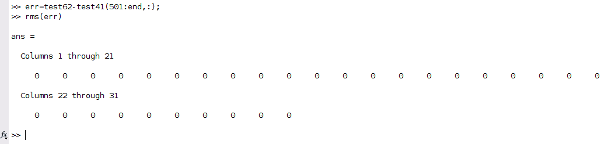
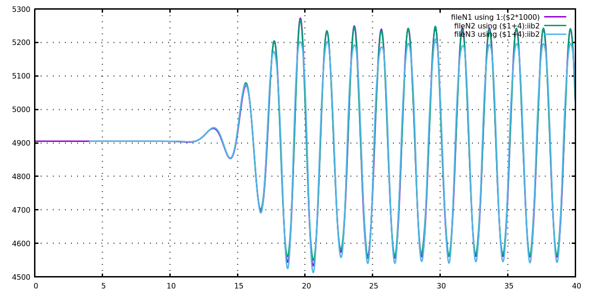
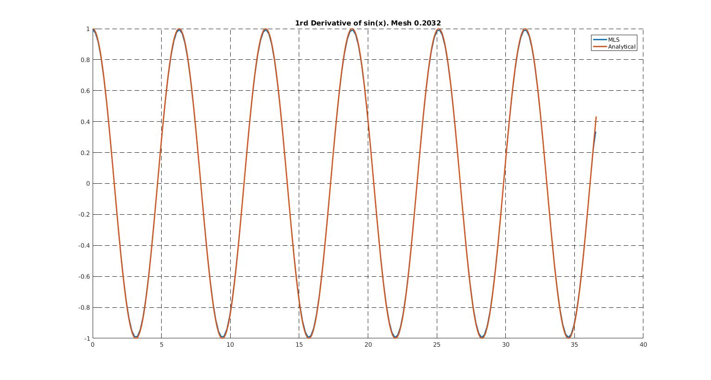

# Vertical velocity calculation

1. [Observations : 3rd Derv consecutive derivative based [2020-03-06]](#log_bsnqM_v0003_1)
1. [Observations : VertVel : Unidirectional wave [2020-03-13]](#log_bsnqM_v0003_2)
1. [Observations : VertVel : Unidirectional wave [2020-04-08]](#log_bsnqM_v0003_3)
1. [Observations : findEleForLocXY [2020-04-20]](#log_bsnqM_v0003_4)
1. [Observations : VertVel : getVertVel [2020-04-24, 2020-04-27]](#log_bsnqM_v0003_5)
1. [Feature : Resume file [2020-05-19]](#log_bsnqM_v0003_6)
	- [IMPORTANT: Resume file issue solved [2020-05-20]](#log_bsnqM_v0003_6_1)
1. [Feature : Removed bsnqQuadHeader [2020-05-22]](#log_bsnqM_v0003_7)
1. [Feature : Subroutine caseOutputs and timeStepRK4 [2020-05-28]](#log_bsnqM_v0003_8)
1. [Feature : OpenMP parallel matrixSet2() [2020-06-29]](#log_bsnqM_v0003_9)

## Attempting
- Calculate velocities along the depth 

## List of Work
- [x] Consecutive derivative based - uDx uDxx uDxxx 
- [x] Consecutive derivative based - pDx pDxx pDxxx 
- [x] Calculation of u, w and pr assuming unidirectional waves
- [ ] Calculation of u, w and pr for directional wave
- [x] Find element containing a random point with natural coords in XY
- [x] Calc vertical velocities at any location
- [x] Wave-probe at random XY using findEleForLocXY and FEM shape fnc. Verified.
- [x] Removed all (except 2) private vars from bsnqModule (wasnt a good idea). Verified.
	- [x] Added type _C\_KCLK_ and private var _nSysC_ for system clock implementation.
- [x] Added _getEtaPQForXY_ in bsnqModule to get vars at any location. Verified.
- [x] BndNodeType preferential allocation code corrected.
- [x] Subroutines _caseOutputs_ and _timeStepRK4_.
- [x] _matrixSet2()_ made parallel using OpenMP. Upto 1.1x speedup.

-----------------------------------------------

## Feature : OpenMP parallel matrixSet2() [2020-06-29]
- Made _matrixSet2()_ CPU parallel using OpenMP.
- I had already before replaced the complex 6x6 and 6x3 writing process with the ele6x6 and ele6x3 arrays.
- The speedup from OpenMP appears to be upto 1.1x. 
- This function is called 4 times in a single time-step and is hence important.
- This slowness of this subroutine was visible during heavy runs such as Chennai port case.
- Verified to match point to point with earlier results using case rect2D.

-----------------------------------------------

## Feature : Subroutine caseOutputs and timeStepRK4 [2020-05-28]

### caseOutputs
- Added subroutines _caseOutputs_ to separate _postInstructs_ from the output generation of 
	- waveProbe 
	- outputXML - Paraview
	- resume output
- This was done for coupling code, where the values may be modifed after tha calculations in RK4 timestep are completed.
- This is also useful to make a sharable version of the code where people might want to add few more outputs after the calculation in RK4 step are calculated, such as sediment transport values.
	- The idea is to enable inclusion of extra outputs, such as sediment transport in the Paraview file. For this the output generation has to be separated from the _postInstructs_.
- It also allows placing initial conditions subroutine in _bsnqQuadMain.f90_, such as _solitIC_ and the first Paraview output will contain the initial condition without going into the _bsnqModule.f90_.
	- This first output can be crucial in checking the initial condition.

### timeStepRK4
- Added subroutine _timeStepRK4_.
	- Mostly no changes were required to be made to this by anyone once it was developed.
	- It avoid unnecessary chance of mistake during coupling and reducing a 60 line code to one line in the main file and thus is perfect for coupling and for sharing.
	
-----------------------------------------------

## Feature : Removed bsnqQuadHeader [2020-05-22]
- Removed bsnqQuadHeader.f90 by moving the include statements to bsnqModule.f90.
- .mod files it seems are like header files, which have the variable and function declarations, but they seem to also need the associated .o files with the definition of the functions. Not 100% sure about this.
- For coupling with _mlpgr3D_ I had to copy bsnqModule.o, bsnqQuadHead.o, bqnGlobVars.mod and bsmqModule.mod.
	- The main program has use bsnqModule and bsnqGlobVars, therefore those .mod files are needed.
	- The definition of subroutines in those .mod files require the respective .o files.
	- So, for the subroutines of of all modules used within bsnqModule were inside bsnqQuadHeader.o and all of the subroutines of bsnqModule were inside bsnqModule.o.
- Now by moving the include statements from bsnqQuadHeader to bsnqModule I have removed the need for bsnqWuadHeader.o, as all of those subroutines will now be within bsnqModule.o. 
- Therefore I have totally removed bsnqQuadHeader.
- **Rule of thumb is, make sure the .mod files are there for the modules you are using in the program, and .o files are there for the subroutines within the chosen .mod files.**

-----------------------------------------------

## Feature : Resume file [2020-05-19]
- Generating resume file using _writeResume_ (done in binary) subroutine inside _outputXML.f90_.
	- p, q, totDep, eta for 1 to linear nodes
	- followed by p, q, totDep for linear+1 to total nodes
	- E20.12
- Resuming in RK4 is easy because information has to be stored only in 1 time-step.
	- In Adam-Basforth 3 point uoi will have to store info at 2 time-steps.
- Reading the resume file using _readResume_ (done in binary)
- Removing bq%rTime, as it is not used and it confuses with b%tOb(0)%rtm.
	- Thankfully I have used bq%tOb(0)%rtm everywhere.

### IMPORTANT: Resume file issue solved [2020-05-20]
Unfortunately this isnt working. There is slight difference in the results after resuming which is unaaceptable. Looking for reason and then the solution.

The tests were done for _ftc1_ case using airy wave theory wave of T=2s, H=0.1m, d=0.7m. The wave probes were compared for cold start (test41) and hot start (resumed at T=10s, test42) cases, through rms(difference). The rms is non-zero for p, q, &eta; a every wave probe! (zeros are the X Y of probes.)

| |
| :-------------: |
| **Figure :** MATLAB rms(hotStart-coldStart) hotstart=test42 coldstart=test41 |
|  |

And the issue is real as shown in the comparison of p, q, &eta; values over time the fist probe.

| |
| :-------------: |
| **Figure :** test41(coldstart)(blue) vs test42(hotstart)(red) |
|  |
|  |
|  |

Although the difference isn't visible for &eta; and p, it can be seen in q. And the rms clearly shows the existence of error in &eta; and p too. Thought not too significant but ut is not ignorable.

- Tested that the issue is not due to wavemaking by comparing a node on the wavemaker.
- I shifted from writing text file **to writing binary file** to ensure that exact values of p, q, and &eta; were copied to the resume file and read from the resume file.
	- This too did not solve the issue of slight differece in results.
- **The I realised that the issue may be due to the starting values of gXW, gXE, and gXPQ at the beginning of the time-step.**
	- Lets say you intend to resume the solution at t=10s, with the timestep 0.02s	
	- In the original run (cold start), the values of gXW, gXE and gXPQ at the beginning of t=10.02s will be non zero.
	- However in the resumed run (hot start) the values of gXW, gXE and gXPQ at t=10.02s will be zero as the program has just started.
	- **Due to this the GMRES solver is being given two different start position of the variables at the first RK4 step, which will invariably lead to different converged solutions!**
	- This was confirmed by making gXW, gXE and gXPQ equal to zero at the beginning od every time-step.
		- This solved the resume file problem and now the solution obtained from cold start and hot start are identical!
		- However this made the computation slower (to about 0.5x for the test case) because the first step of RK4 required significantly higher number of iterations to reach convergence.
		- That was easily sorted by also saving the binary values of gXW, gXE and gXPQ in the resume file thus preventing the need to make them zero at the beginning of every time-step.
	- **Note how a small difference in starting value of solution given to GMRES at one stage of one time-step calculation made such a big difference!**

So Now the resume file works properly, is stored in binary, and the resume happens exactly, with no difference in results between cold and hot start as shown in the following figure.

| |
| :-------------: |
| **Figure :** MATLAB rms(hotStart-coldStart) hotstart=test62 coldstart=test41 |
|  |

-----------------------------------------------

## Observations : VertVel : getVertVel [2020-04-24]
- Restructred vertVelDerv from bDf%u(npt) tp bDf(npt)%u. This is necessary to make it easier in coupling function _getVertVel_ to interpolate all values at the random MLPG point. **It has been tested and verified with T=2s, H=0.1m, d=0.7m, kh=0.95.**
- Completed _getVertVel_ to obtain vertical velocities at any location inside the bsnq domain.
	- Uses FEM shape function to interpolate values at the random location from values of 6 nodes within the element.
	- Extensively tested and verified for location inside triangle, on the edge of teh triangle and on the vertices of triangle. Run _tesyGetVertVel_ (output in fort.120) for testing _getVertVel_. **The results are identical to results in VertVel [2020-04-08]
	- Works very well with hardly any effect on the speed.
	- **Currently v-vel is kept 0, as it is still considering only unidirectional waves**.
	- OpenMP implemented wherever possible. 
	- **_getVertVel_ Error reporting:** The array err is to check if that point has successfully got velocities from bsnq.
		- err = 0 : No error
		- err = 1 : Location is not inside any bsnq element.
			- uOut, vOut, wOut, pOut will be returned = 0. Here pOut is pressure.

### Update [2020-04-27]
- Added _getEtaPQForXY_ into the bsnqModule. 
- This allows extracting these variables at any location if required in future. It might be useful in coupling two bsnq instances.
- The subroutine _getVertVel_ was not giving these variables.
- **_getEtaPQForXY_ Error reporting:** The array err is to check if that point has successfully got velocities from bsnq.
	- err = 0 : No error
	- err = 1 : Location is not inside any bsnq element.
		- etaOut, pOut, qOut will be returned = 0

-----------------------------------------------

## Observations : findEleForLocXY [2020-04-20]
- Done based on cross product.
- For triangle in anti-clockwise ABC, with point P, AB x AP, BC x BP, CA x CP should all have +ve sign.
- Once the element in found, the natural coordinates &epsilon; and &eta; are found using the following formula using the transpose of inverse of Jacobian.
- A check was performed for both element search and natural coordinates using a random point with sucessful result.
- **Two forms of the function are written** 
	1. **findEleForLocXY1** : Single location search. No OpenMP implementation
	1. **findEleForLocXY2** : An array of locations. OpenMP implemented
- **Error reporting**
	- If point lies inside no element then
		- eleId = -1
		- &epsilon; = -1
		- &eta; = -1

| |
| :-------------: |
| **Figure :** Formula for calculating the natural coordinates &epsilon; and &eta; using transpose of inverse of Jacobian |
|  |

-----------------------------------------------

## Observations : VertVel : Unidirectional wave [2020-04-08]
- Modified the expression _Model 1 : uh = p / tD x h_ to _Model 2 : uh = p_, in order to see if there is a non-linearity effect to improve the accuracy for higher kh values.
- However as seen from the tests for T=2.0s kh=0.5, which were excellent for _Model 1_ are now not as good for _Model 2_. 
- I cannot do this test for Airy wave and check because the expressions in Airy wave are only valid till z=0 and not above it.
- As seen from the figures the issue is mainly in the crests of the pressure. Infact the velocities for the z=-0.35 are pretty good match for both models.
- So for now leaving it at _Model 1_ for which the results are in "Observations : VertVel : Unidirectional wave [2020-03-13]"
- The results for this test can be seen in 'Output_VertVel/vsrMonoC2_T2p0_dt0p005_uh_eq_p_Model2_Trial'

#### Regular T=2.0s, H=0.1m, d=0.7m, kh=0.95 generated in FNPT2D using 2nd order wavemaker theory and transferred to Bsnq at x=5m.

| |
| :-------------: |
| **Figure :** Resuts from Bsnq **(using _Model 2 : uh = p_ (Green) instead of _Model 1_)** compared against FNPT (purple) for <b>eta</b> at x=20m |
|  |

| |
| :-------------: |
| **Figure :** Resuts from Bsnq (green) **(using _Model 2 : uh = p_ (Blue) instead of _Model 1 (Green)_)** compared against FNPT (purple)  |
| **Pressure** at x=20m, **z=-0.5m** |
|  |
| **uVel** at x=20m, **z=-0.5m** |
|  |
| **wVel** at x=20m, **z=-0.5m** |
|  |

| |
| :-------------: |
| **Figure :** Resuts from Bsnq (green) **(using _Model 2 : uh = p_ (Blue) instead of _Model 1 (Green)_)** compared against FNPT (purple) |
| **Pressure** at x=20m, **z=-0.35m** |
|  |
| **uVel** at x=20m, **z=-0.35m** |
|  |
| **wVel** at x=20m, **z=-0.35m** |
|  |

-----------------------------------------------

## Observations : VertVel : Unidirectional wave [2020-03-13]
- With the derivatives confirmed I proceeded with calculation of the vertical velocity based on Dingemans (1994, pg. 390). 
- Regular waves of T=2s and 1.5s, H=1m, h=0.7m were generated in fnpt and the solution was transferred to Bsnq at 5m.
- Probes were placed at x=20m, z=-0.50m and z=-0.35m in both fnpt and Bsnq.
- In this reference the expression of u seems to be correct and was verified by comparing against fnpt.
- However the expression for w and pr is wrong.
- This mistake was verified by testing in Mathematica the results obtained from Dingemans (1994, pg. 390) expressions for Airy wave theory. Check the file 'VertVel_UnidirectionalWave/CheckFormulaUsingAiryWaveTheory.nb'.
- The correction for w was made using the continuity equation.
- The correction for pressure was made using the w momentum equaitons and considering only d(w)/dt = -grad(P)/rho + g, and taking only the first term in the corrected w expression for calculation of d(w)/dt.
- **From the tests for T=2.0s kh=0.5 we can see that the match is excellent for u, w, and pr. However the match is not very good for T=1.5s kh=1.4 for w and pr.**

| |
| :-------------: |
| **Figure :** The correction of equations given in Dingemans (1994). |
|  |

| |
| :-------------: |
| **Figure :** Comparison of the results for velocity and pressure for Airy wave obtained from the Airy wave theory (u, w, pr) vs Dingemans (uc = uDing, wDing, prDing) and the corrected expressions (uc, wc prc) |
|  |
|  |
|  |

#### Regular T=2.0s, H=0.1m, d=0.7m, kh=0.95 generated in FNPT2D using 2nd order wavemaker theory and transferred to Bsnq at x=5m.

| |
| :-------------: |
| **Figure :** Resuts from Bsnq (green) compared against FNPT (purple) for eta at x=20m |
|  |

| |
| :-------------: |
| **Figure :** Resuts from Bsnq (green) compared against FNPT (purple) |
| **Pressure** at x=20m, **z=-0.5m** |
|  |
| **uVel** at x=20m, **z=-0.5m** |
|  |
| **wVel** at x=20m, **z=-0.5m** |
|  |

| |
| :-------------: |
| **Figure :** Resuts from Bsnq (green) compared against FNPT (purple) |
| **Pressure** at x=20m, **z=-0.35m** |
|  |
| **uVel** at x=20m, **z=-0.35m** |
|  |
| **wVel** at x=20m, **z=-0.35m** |
|  |

#### Regular T=1.5s, H=0.1m, d=0.7m, kh=1.4 generated in FNPT2D using 2nd order wavemaker theory and transferred to Bsnq at x=5m.

| |
| :-------------: |
| **Figure :** Resuts from Bsnq (green) compared against FNPT (purple) for eta at x=20m |
|  |

| |
| :-------------: |
| **Figure :** Resuts from Bsnq (green) compared against FNPT (purple) |
| **Pressure** at x=20m, **z=-0.5m** |
|  |
| **uVel** at x=20m, **z=-0.5m** |
|  |
| **wVel** at x=20m, **z=-0.5m** |
|  |

| |
| :-------------: |
| **Figure :** Resuts from Bsnq (green) compared against FNPT (purple) |
| **Pressure** at x=20m, **z=-0.35m** |
|  |
| **uVel** at x=20m, **z=-0.35m** |
|  |
| **wVel** at x=20m, **z=-0.35m** |
|  |

-----------------------------------------------

## Observations : 3rd Derv consecutive derivative based [2020-03-06]
- Analytical function sin(x) was used to check till third derivative calculated using the MLS code.
- The consecutive derivative based approach is:
	- f'(x) = d ( f(x) )/ dx
	- f''(x) = d ( f'(x) )/ dx
	- f'''(x) = d ( f''(x) )/ dx  
- The subroutine is _calcDerv_, part of bsnqModule. It will only be called if the pObf is allocated by the subroutine _setMFree_, also a part of bsnqModule.
- From the results below it can be seen that near the boundaries the 2nd and 3rd derivatives are inaccurate. **This can be a issue in calculating depth resolved velociies for coupling near the boundaries.**

| |
| :-------------: |
| **Figure :** Results of 1st, 2nd and 3rd derivatives of sin(x) compared for MLS code against. |
|  |
|  |
|  |

-----------------------------------------------

## References
1. Bosboom, Judith. 1995. “Boussinesq Modelling of Wave-Induced Particle Velocities.” TUDelft.

1. Dingemans, M. W. 1994. “Water Wave Propagation over Uneven Bottoms.” TUDelft.
