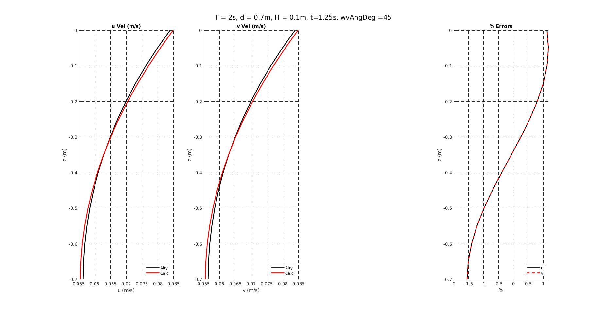

# Vertical velocity angular

1. [Wave-angle [2020-07-03]](#log_bsnqM_v0004_1)
1. [VertVelAng Attempt-1 (Wrong) [2020-07-05]](#log_bsnqM_v0004_2)
1. [VertVel 2D Derivation of w [2021-06-08]](#log_bsnqM_v0004_3)
1. [VertVel 2D Checking Pressure [2021-06-08]](#log_bsnqM_v0004_4)
1. [VertVel 3D Derivation of vels [2021-06-08]](#log_bsnqM_v0004_5)
1. [Observations : VertVel 3D Matlab Check [2021-06-08]](#log_bsnqM_v0004_6)
1. [Observations : VertVel 3D Confirming against VertVel 2D [2021-06-08]](#log_bsnqM_v0004_7)
1. [Observations : VertVel 3D Comparison for various angles [2021-06-08]](#log_bsnqM_v0004_8)
1. [Observations : Dependence of Bsnq result on Mesh [2021-11-03]](#log_bsnqM_v0004_9)

## Attempting
- Calculate velocities along the depth for angular waves
- Try and avoid calculation of 'w' velocity. We already avoided need for pressure


## List of Work
- [x] Calculate local wave-angle. _locWvAng()_
- [x] BUG_FIX: wavHReset had a mistake. <br>Only mod(12.01,3) would work. mod(11.99,3) wont work. Corrected.
- [x] Angular wave expression for depth-resolved vel.
- [x] z=0 set to mean-sea-level instead of bottom of the domain.

-----------------------------------------------


<a name = 'log_bsnqM_v0004_9' ></a>

## Observations : Dependence of Bsnq result on Mesh [2021-11-03]


Refer folder : bsnq/Test_stokes2b_bsnq/case3_reChk_corrected2

1. While coupling with MLPG, I noticed that the mesh made a significant difference in the position of the particle which are purely driven by the Bsnq solution.

2. There were some mistakes in my MLS radius and neighbours search, which I have corrected and can be seen in [link](./log_bsnqM_vBugs.md#log_bsnqM_vBugs_4).

3. After this I did a test with the three mentioned meshes. <br> With the updates in the MLS nei and rad and searching radius (mentioned in the previous point), we see that for all three meshes we get same neighbouring MLS nei as seen in figures below for boundary and middle nodes. <br>
Blue-Mesh1 Orange-Mesh2 Yellow-Mesh3 <br>
<br>


4. Hence there shouldnt me any difference in the results from the MLS part.

5. However the issue mentioned in point-1 arises from the difference in the results of the Bsnq solution itself.

In the following table, I present the BQML results. Here a [-0.5m 30.5m] MLPG domain is coupled with Bsnq on both left and right sides with 3m overlapping layers on each sides.<br>
Note the difference in the position of purely Bsnq driven MLPG particles

| Difference in MLPG particle position which are purely driven by Bsnq |
| -------- |
|   |
| **Eta** |
|  |
| Legend : Pink-BQML-Mesh1, Blue-BQML-Mesh2, Green-BQML-Mesh3, Black-Bsnq  |
|   |
| **MLPG Eta contour plot** |
|  |
| BQML-Mesh1-Eta, BQML-Mesh2-Eta, BQML-Mesh3-Eta, BQML-MeshAll-BsnqWei |

<br>

| Difference in the Bsnq soln from the three meshes |
| -------- |
|   |
| **DepIntVel-Y** |
|  |
|   |
|   |
| **DepRedVel-Y at d=-h/3** |
|  |
|   |
|   |
| **DepRedVel-X at d=-h/3** |
|  |
|   |

I had also run the simulation in BQML setting Bsnq vel_y = 0 in coupling to see if the issue is due to the depResVel_y. It can be seen that the issue is arising from depResVel_x itself.

| Difference in MLPG particle position which are purely driven by Bsnq <br> Bsnq depResVel_y=0 in the coupling procedure |
| -------- |
|   |
| **Eta** |
|  |
| Legend : Pink-BQML-Mesh1, Blue-BQML-Mesh2, Green-BQML-Mesh3, Black-Bsnq  |
|   |
| **MLPG Eta contour plot** |
|  |
| BQML-Mesh1-Eta, BQML-Mesh2-Eta, BQML-Mesh3-Eta, BQML-MeshAll-BsnqWei |

-----------------------------------------------


<a name = 'log_bsnqM_v0004_8' ></a>

## Observations : VertVel 3D Comparison for various angles [2021-06-08]

The case7 from the [previous](#log_bsnqM_v0004_7) comparison between Bsnq-2D and Bsnq-3D was repeated at various domian angles.

| SN  | Regime | h/(gT^2) | H/(gT^2) | h <br> (m) | T <br> (s)| H <br> (m) | L <br> (m) | kh | ka | Remarks |
| --- | ----- | ----- | ----- | ----- | ----- | ----- | ----- | ----- | ----- | ----- |
| 7 | Stokes2  | 0.7865 e-2 | 0.629 e-3 | 1.00 | 3.6000 | 0.0800 | 10.690 | 0.5877 | 2.3511 e-2 | Excellent match in every way. |

I rotated the domain to various angles such as 30deg, 45deg and 90deg.<br>
I had to make the sidewalls as bnd12 (no-slip) for all these cases because bnd13 (slip) was not possible for 30deg and 45deg.

Due to this the comparison with Stokes2 wasnt good, but you can see the excellent comparison for this case when bnd13 (slip) is applied in the [previous](#log_bsnqM_v0004_7) comparison.

Also for Bsnq00 and Bsnq90 I had a sponge layer in the 150m domain.<br>
In the Bsnq45 and Bsnq30 I couldnt have put a sponge layer and hence had to use a 300m domain with no sponge layer.


| Stokes2 (black) vs Bsnq00 (red) vs Bsnq90 (blue) vs Bsnq45 (green) vs Bsnq30 (magenta) |
| ------------------------------------------------ |
| eta comparison |
|  |
| Depth integration velocity X comparison |
|  |
| Crest, trough and zero down-cross vel comparison |
|  |
| Crest, trough and zero down-cross pres comparison |
|  |
| eta comparison zoomed |
|  |
| Depth integration velocity X comparison zoomed |
|  |

- The eta for all matches almost point to point.
    - The difference with the Stokes2 is due to the bnd12 in sidewall. Otherwise with bnd13 we get an excellent comparison with Stokes2.
- The depIntVel-X matches exactly for Bsnq00 and Bsnq90, but there is a difference in Bsnq30 and Bsnq45 as seen in the zoomed in plot of depIntVel-X.
    - Due to this we have difference in the vel-u in peak and trough.
- I am not totally sure why the difference was there in depIntVel-X.
    - I had rotated the mesh, hence the mesh orientation was always in the direction of the wave propagation
    - It might be due to the lack of sponge layer in Bsnq30 and Bsnq45, but still then the results for these two should have been similar which isnt the case.
- Anyway the difference is not likely due to the implementation of vertVel and is instead likely due to the difference in depIntVel-X.    


Results in 'Test_stokes2/case7/bnd12_analysis_3D'

-----------------------------------------------


<a name = 'log_bsnqM_v0004_7' ></a>

## Observations : VertVel 3D Confirming against VertVel 2D [2021-06-08]
A case was run with 3D formula in order to confirm the implementation against the 2D formula code.

Domain has sidewalls type13 (slip).

| SN  | Regime | h/(gT^2) | H/(gT^2) | h <br> (m) | T <br> (s)| H <br> (m) | L <br> (m) | kh | ka | Remarks |
| --- | ----- | ----- | ----- | ----- | ----- | ----- | ----- | ----- | ----- | ----- |
| 7 | Stokes2  | 0.7865 e-2 | 0.629 e-3 | 1.00 | 3.6000 | 0.0800 | 10.690 | 0.5877 | 2.3511 e-2 | Excellent match in every way. |


| case7 : Stokes2 (black) vs FNPT (red) vs Bsnq-2D (blue) vs Bsnq-3D (green) | 
| ---------------------------------------------- |
| eta comparison |
|  |
| Depth integration velocity X comparison |
|  |
| Crest, trough and zero down-cross comparison |
|  |

It is seen than there is only a marginal difference between 3D and 2D expressions in the u vel under the crest and trough and w vel in the zero down-cross.

-----------------------------------------------


<a name = 'log_bsnqM_v0004_6' ></a>

## Observations : VertVel 3D Matlab Check [2021-06-08]
- The MATLAB code was written for checking the u and v expressions.
- Did not yet check the w expression
- The code file is "OtherCodes/Matlab/VertVel_Angular/vertVel_21.m"

```MATLAB
function [u0c, v0c, w0c, uErr, vErr, wErr] = calcAll(d, indX, indY, et0, u0, v0, w0, pr0, p0, q0, umM, vmM, umdM, vmdM, dx, z0)
    fprintf('z = %10.4f \n', z0);

    um0 = umM(indY, indX);
    um0_x = ( umM(indY, indX+1) - umM(indY, indX-1) ) / 2/dx;
    umd0_x = ( umdM(indY, indX+1) - umdM(indY, indX-1) ) / 2/dx;
    um0_xx = ( umM(indY, indX+1) - 2*umM(indY, indX) + umM(indY, indX-1) ) / dx/dx;
    umd0_xx = ( umdM(indY, indX+1) - 2*umdM(indY, indX) + umdM(indY, indX-1) ) / dx/dx;
    um0_xxx = ( 0.5*umM(indY, indX+2) - umM(indY, indX+1) + umM(indY, indX-1) -0.5*umM(indY, indX-2) ) / dx^3;
    umd0_xxx = ( 0.5*umdM(indY, indX+2) - umdM(indY, indX+1) + umdM(indY, indX-1) -0.5*umdM(indY, indX-2) ) / dx^3;
    
    um0_xy = ( umM(indY+1, indX+1) - umM(indY-1, indX+1) - umM(indY+1, indX-1) + umM(indY-1, indX-1) ) / 4/dx/dx;
    umd0_xy = ( umdM(indY+1, indX+1) - umdM(indY-1, indX+1) - umdM(indY+1, indX-1) + umdM(indY-1, indX-1) ) / 4/dx/dx;               

    vm0 = vmM(indY, indX);
    vm0_y = ( vmM(indY+1, indX) - vmM(indY-1, indX) ) / 2/dx;
    vmd0_y = ( vmdM(indY+1, indX) - vmdM(indY-1, indX) ) / 2/dx;
    vm0_yy = ( vmM(indY+1, indX) - 2*vmM(indY, indX) + vmM(indY-1, indX) ) / dx/dx;
    vmd0_yy = ( vmdM(indY+1, indX) - 2*vmdM(indY, indX) + vmdM(indY-1, indX) ) / dx/dx;
    vm0_yyy = ( 0.5*vmM(indY+2, indX) - vmM(indY+1, indX) + vmM(indY-1, indX) -0.5*vmM(indY-2, indX) ) / dx^3;
    vmd0_yyy = ( 0.5*vmdM(indY+2, indX) - vmdM(indY+1, indX) + vmdM(indY-1, indX) -0.5*vmdM(indY-2, indX) ) / dx^3;
    
    vm0_yx = ( vmM(indY+1, indX+1) - vmM(indY+1, indX-1) - vmM(indY-1, indX+1) + vmM(indY-1, indX-1) ) / 4/dx/dx;
    vmd0_yx = ( vmdM(indY+1, indX+1) - vmdM(indY+1, indX-1) - vmdM(indY-1, indX+1) + vmdM(indY-1, indX-1) ) / 4/dx/dx;
        

    u0c = um0 + (d*d/6 - z0*z0/2)*( um0_xx + vm0_yx ) ...
            - (d/2 + z0)*( umd0_xx + vmd0_yx );    

    v0c = vm0 + (d*d/6 - z0*z0/2)*( um0_xy + vm0_yy ) ...
            - (d/2 + z0)*( umd0_xy + vmd0_yy );

    w0c = 0;
     
    uErr = (u0c - u0)/u0*100;
    vErr = (v0c - v0)/v0*100;
    wErr = (w0c - w0)/w0*100;
    
    fprintf('( p, q ) = ( %10.4f, %10.4f ) \n', p0, q0 );
    fprintf('u = %10.4f, %10.4f, %10.4f \n', u0, u0c, uErr );
    fprintf('v = %10.4f, %10.4f, %10.4f \n', v0, v0c, vErr );
    fprintf('w = %10.4f, %10.4f, %10.4f \n\n', w0, w0c, wErr );

end 
```

### Comparison with Airy

| Various wave angles, u and v comparison |
| --------------------------------------- |
| wvAng = 00 deg |
|  |
| wvAng = 90 deg |
|  |
| wvAng = 45 deg |
|  |
| wvAng = 30 deg |
|  |
| wvAng = 60 deg |
|  |

-----------------------------------------------


<a name = 'log_bsnqM_v0004_5' ></a>

## VertVel 3D Derivation of vels [2021-06-08]
The expression for the u, v velocity is easily extended using notation as mentioned in Dingemans (1994).<br>
The expression for w was re-derived using the continuity equation.<br>
I did not verify the constant of integration for w, and just extended it from the expected constant as per the 2D expression.

<br>


Written in Latex, it would look like the expression below in a paper.


-----------------------------------------------


<a name = 'log_bsnqM_v0004_4' ></a>

## VertVel 2D Checking Pressure [2021-06-08]
I had to verify if the pressure expression is retaining all the terms upto the limit of error of O(&epsilon;^2 &mu;, &epsilon; &mu;^2).


-----------------------------------------------


<a name = 'log_bsnqM_v0004_3' ></a>

## VertVel 2D Derivation of w [2021-06-08]
Refer to the images below for the derivation of w by substituting the expression for u in the continuity equation.<br>
This is 2D only. <br>
This was done to confirm that the obtained expression for w should be valid for a sloping bottom.<br>
The constant of integration w.r.t z is obtained by applying the bottom BC.

<br>


-----------------------------------------------


<a name = 'log_bsnqM_v0004_2' ></a>

## VertVelAng Attempt-1 (Wrong) [2020-07-05]
- Not using wave-driection _(nx, ny)_ because that becomes too complex and unreliable. Wave direction is notoriously difficult to find.
- Assuming that _u_ only depends on _(p, z, h)_ and _v_ only depends on _(q, z, h)_
    - _u_ and _v_ are calculated using the exact same expression as the uni-directional wave, except that for _v_ we replace _p_ with _q_ and x-derivatives with y-derivatives.
- Velocity _w_ depends on _(p, q, z, h)_.
    - Calcualted the expression for unidirectional wave using _(p, z, h)_ and x-derivatives.
    - Add to the above the expressions for unidirectional wave using _(q, z, h)_ and y-derivatives.
    - No cross-derivatives

The expressions are given below, done in the Matlab code 'OtherCodes/Matlab/VertVel_Angular/vertVel_3.m'

```
    u0c = um0 - 0.5*d * ( umd0_xx ) ...
           + d*d/6 * ( um0_xx ) ...
           - z0 * ( umd0_xx ) ...
           - z0*z0/2 * ( um0_xx );

    v0c = vm0 - 0.5*d * ( vmd0_yy ) ...
           + d*d/6 * ( vm0_yy ) ...
           - z0 * ( vmd0_yy ) ...
           - z0*z0/2 * ( vm0_yy );

    w0c = - ( umd0_x ) ...
          - z0 * ( um0_x ) ...
          + z0*d/2 * ( umd0_xxx ) ...
          - z0*d*d/6 * ( um0_xxx ) ...
          + z0*z0/2 * ( umd0_xxx ) ...
          + z0*z0*z0/6 * ( um0_xxx );
          - ( vmd0_y ) ...
          - z0 * ( vm0_y ) ...
          + z0*d/2 * ( vmd0_yyy ) ...
          - z0*d*d/6 * ( vm0_yyy ) ...
          + z0*z0/2 * ( vmd0_yyy ) ...
          + z0*z0*z0/6 * ( vm0_yyy );
```

-----------------------------------------------


<a name = 'log_bsnqM_v0004_1' ></a>

## Wave-angle [2020-07-03]

### Method-Vel [mostly wrong]
- The convectional expression for wave angle is using wave-elevation. <br> tan( &theta; ) = (d&eta;/dy) / (d&eta;/dx) as given in Sorenson (2004) while describing roller-breaker.
- But instad of calculating the derivatives I am relying on depth-integ vel P Q and hoping the results tan( &theta; ) = Q / P will be alright
- Calculated if the velMag .gt. 1d-10

### Method-Eta [mostly wrong]
- The convectional expression for wave angle is using wave-elevation. <br> tan( &theta; ) = (d&eta;/dy) / (d&eta;/dx) as given in Sorenson (2004) while describing roller-breaker.
- Calculated using MLS shape function.
- No visible effect on run-time.

### Results

| |
| :-------------: |
| **Figure :** Wave-Angle calculated using Vel vs calculated using Eta |
|  |
| **Figure :** Wave-Angle calculated using Vel vs calculated using Eta along centre-line of the domain |
|  |
| **Figure :** Wave-Angle calculated using Vel vs calculated using Eta along centre-line of the domain at t = 20s|
|  |

The observations are :

- The local instantaneous wave angle from Vel and Eta have a phase difference of 90deg for the uni-directional wave, before the collision with the wall.
- After the collision with the wall the returning wave super-imposing on the forward wave give similar wave angle as calculated using Vel and Eta.
- Method-Vel is more noisy and sensitive.
- The &Eta; wave elevation is anyways smoother than velocity, and additionally the MLS derivative ensures its more smooth.
- Method-Eta is mentioned in a paper, hence it may be correct, but neither seem very useful for the particle velocity calculations!
- Keeping the Method-Eta and commenting out the Method-Vel.

**For now I have disabled _lovWvAng()_ inside _postInstructs()_ by commenting it because it is not needed by default.**

-----------------------------------------------

## References

1. Madsen, P. A., & Agnon, Y. (2003). Accuracy and convergence of velocity formulations for water waves in the framework of Boussinesq theory. Journal of Fluid Mechanics, 477(477), 285–319. https://doi.org/10.1017/S0022112002003257

1. Dingemans, M. W. 1994. “Water Wave Propagation over Uneven Bottoms.” TUDelft.