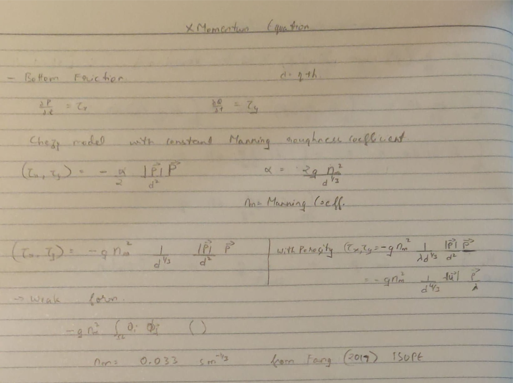

# Common algorithm developments in the code

1. [Paralution solver FORTRAN plugin [2020-10-15]](#log_bsnqM_vAlgo_1)
2. [Test pressure term with integration by parts [2021-02-28]](#log_bsnqM_vAlgo_2)
3. [Stokes2 wave input added [2021-04-06]](#log_bsnqM_vAlgo_3)
4. [Wave input - Wheeler stretching [2021-04-28]](#log_bsnqM_vAlgo_4)
5. [Bottom Friction [2021-06-21]](#log_bsnqM_vAlgo_5)
6. [Time ramping for wave-making [2021-06-22]](#log_bsnqM_vAlgo_6)
7. [Source function based wavemaking [2021-06-29][2021-10-08]](#log_bsnqM_vAlgo_7)
8. [Absolute tolerance test for Berkhoff shoal [2021-10-08]](#log_bsnqM_vAlgo_8)
9. [Feature: bnd13 on angular sides [2021-12-06]](#log_bsnqM_vAlgo_9)
10. [Observation: Brute force vs FEM-linked-list search comparison](#log_bsnqM_vAlgo_10)
11. [Feature: Exact solitary wave generation [2022-04-30]](#log_bsnqM_vAlgo_11)


## Attempting
- From 2020-Dec-01 onwards, the common algorithm developments will be noted in this document.
- This log file should only be updated for a branch if the algorithm has been implemented in that branch.


## List of Work
- [x] Test pressure term with integration by parts [Link](#log_bsnqM_vAlgo_2)
- [x] Added _fem_dN6iSc6dx_N6j()_ femAnalyticalTri_v1.1.f90
- [ ] waveFileModule search to binary instead of sequential
- [x] waveFileModule time-series interpolated by cubic spline instead of linear. Verified implementation. [2021-04-05]
	- Check the importance of this for shipMod. May not matter in this though [link](./log_bsnqM_v0002.md#log_bsnqM_v0002_13)
- [x] Stokes2 wave input in 'modsInletBC.f90' [2021-04-06] [link](#log_bsnqM_vAlgo_3)
- [x] Bottom Friction [link](#log_bsnqM_vAlgo_5)
- [x] Wave-making time ramped [link](#log_bsnqM_vAlgo_6)
- [x] Internal wave maker [link](#log_bsnqM_vAlgo_7)
	- [ ] Internal wave-maker of a limited length
- [ ] RK4 time-interpolation
- [x] Exact solitary wave generation [link](#log_bsnqM_vAlgo_11)

-----------------------------------------------


<a name = 'log_bsnqM_vAlgo_11' ></a>

## Exact solitary wave generation

- One of the reviewers of the OE (2022) Bsnq paper had asked us to do convergence study through solitary wave.

- This is because for solitary wave, you can solve the weakly non-linear Boussinesq equation in 1D nearly exactly.

- The reviwer pointed us to likely one of his/her publication (Ricchiuto 2014). I already had this publication.

- From this I referred to Orszaghova (2012) (which I had previously read) to follow the procedure for exact solution of solitary wave for Madsen and Sorenson's form of weakly non-linear Boussinesq equation

- Wrote a Matlab code to generate the wave and depth integrated velocity. <br> File: bsnq/OtherCodes/solitaryWave/solitary_v2.m

- I output the solution to a .dat file, at a resolution appropriate for the depth-intergrated vel P. <br> i.e., is mesh is set to dx = 0.10, the P will be at resolution dx = 0.05. So I output the Matlab solution at dx = 0.05 to ensure I get point to point values for P and eta everywhere, without interpolation

- Wrote the subroutine _solitaryICFromFile()_ in intialConditions.f90 to enable the point to point read of the solution from the .dat file.

- Resultant simulation of the solitary wave produces minimum tail, unlike the previous method _solitaryIC()_ of using the cosh function to generate the wave.

- The comparison between the old and new generation method was tested for a A/h = 0.2 solitary wave. <br> Folder: bsnq/Test_sol/sol_m0200 vs bsnq/Test_sol/sol_m0200_cosh

- Domain is [-100 200]. The wave has peak at x=0 at t=0

We observe that

- Initial shape is different in the exact solution method compared to the cosh method
- The cosh method immediately starts shedding extra components as a tail to fit the solution to the Bsnq eqn, and hence lose amplitude. <br> This is almost completely absent in the new exact solution method
- Almost no dissipation of amplitude and no tail in case of exact solution, even after 30s of propagation for 100m.

|  New Method (black) vs Old method (blue &eta; / red P)   |
| --- |
| **t=0s Between x = [-25 25]** |
|  |
|  |
| **t=16s Between x = [25 75]** |
|  |
|  |
| **t=30s Between x = [75 125]** |
|  |
|  |


### Important Update

- We should be careful to use this 'exact' method.
- Its still a numerical solution
- You are still doing a nuemrical integration along the space
- So the step size of the numerical integration of the 'exact' solution matters a lot
- I was doing the mesh convergence study. For the finest mesh it didnt work earlier. I thought mistake in bsnq mode. But no.
- Take the following teo setups
    - Setup-1: Bsnq mesh dx=0.05m dt=0.00625s Cou=0.44, exact soln dx=0.01m
    - Setup-2: Bsnq mesh dx=0.05m dt=0.00625s Cou=0.44, exact soln dx=0.001m
- My simulation was giving spurious reuslts and failing with Setup-1.
- I had to reduce the step size for the 'exact' solution to get a stable result.
- The instability and inaccuracy in Setup-1 came from the initial condition specified to the Bsnq model by the 'exact' solution.
- The difference in the exact solution with dx=0.01m and dx=0.001m is miniscual! Still made a huge difference in the Bsnq simulation.


|    |
| --- |
| **Setup-1 (fails) t=08s between x=[-50 50]** |
|  |
|  |
| **Setup-2 (works) t=08s between x=[-50 50]** |
|  |
|  |
| **Setup-2 (works) t=30s between x=[80 120]** |
|  |


### References

1. Ricchiuto, M., Filippini, A.G., 2014. Upwind residual discretization of enhanced Boussinesq equations for wave propagation over complex bathymetries. Journal of Computational Physics 271, 306–341. [link](https://doi.org/10.1016/j.jcp.2013.12.048)

1. Orszaghova, J., Borthwick, A.G.L., Taylor, P.H., 2012. From the paddle to the beach - A Boussinesq shallow water numerical wave tank based on Madsen and Sorensen equations. Journal of Computational Physics 231, 328–344. [link](https://doi.org/10.1016/j.jcp.2011.08.028)


-----------------------------------------------


<a name = 'log_bsnqM_vAlgo_10' ></a>

## Observation: Brute force vs FEM-linked-list search comparison

I checked using rect2D and caseE3aW10 meshes the brute force vs the FEM-linked-list algo to search the neighbours and find out the order of complexity for each method

Output file from rect2D_brute

```
 [INF]      LinNode    QuadNode     TotNode      nEdges
 [---]         5611       16410       22021       16410

 [MSG] Size of mFree : npt, sum(nn), MB           22021         792893      21.172527
 [MSG] Done setMFree
 [TIM]          0.2065
```

Output file from rect2D_FEMLinkedList

```
 [INF]      LinNode    QuadNode     TotNode      nEdges
 [---]         5611       16410       22021       16410

 [MSG] Size of mFree : npt, sum(nn), MB           22021         792893      21.172527
 [MSG] Done setMFree
 [TIM]          0.6379
```

Output file from caseE3aW10_FEMLinkedList

```
 [INF]      LinNode    QuadNode     TotNode      nEdges
 [---]       141876      423125      565001      423125

 [MSG] Size of mFree : npt, sum(nn), MB          565001       20775120     554.755554
 [MSG] Done setMFree
 [TIM]        438.4095
```

Output file from caseE3aW10_FEMLinkedList

```
 [INF]      LinNode    QuadNode     TotNode      nEdges
 [---]       141876      423125      565001      423125

 [MSG] Size of mFree : npt, sum(nn), MB          565001       20775120     554.755554
 [MSG] Done setMFree
 [TIM]         27.2988
```


| Nodes |	Time-Brute |	Time-FEM | Order of complexity
| ---- | ---- | ---- | ---- | 
| 22021 |	0.6379 |	0.2065 | 2.0133 |
| 565001 |	438.4095 |	27.2988 | 1.5052 |

Order of complexity = log(T2 / T1) / log(N2 / N1)

-----------------------------------------------

<a name = 'log_bsnqM_vAlgo_9' ></a>

## Feature: bnd13 on angular sides [2021-12-06]

Folder: bsnq/Test_bnd13

- Till now the bnd13 of slip wall was working only if the domain had sides along the X and the Y axes.
- Now I generalised it so that it works irrespective of the orientation of the side.
- Take (nx, ny) as the side normal
	- If (abs(nx) > 0.86) => side normal angle < 30deg<br> Then limit the P vel as P = -Q\*ny/nx and allow free calculation of Q
	- Every other case => side normal angle > 30deg <br> Then limit the Q vel as Q = -P\*nx/ny and allow free calculation of P

|     |
| --- |
| **waveAlong 70 deg => bnd13 nx 20deg => P is limited** <br> vs <br> **waveAlong 20 deg => bnd13 nx 70deg => Q is limited** |
|  |
|  |

**Note: It may fail for random curved boundaries. Use bnd12 for those**

-----------------------------------------------


<a name = 'log_bsnqM_vAlgo_8' ></a>

## Absolute tolerance test for Berkhoff shoal [2021-10-08]

After the correction of RK4 time-marching procedure I re-investigated the tolerance requirement for the code.

Refer to this description of the mistake in RK4 time-marching [here](./log_bsnqM_vBugs.md#log_bsnqM_vBugs_3)

The test was done using Berkhoff shoal test case using a irregular mesh as shown below.<br>


The absolute error limit is solver is for `r = AX-B`, and not for `X` itself. Hence you cannot draw conclusions on the error in `X` based on the error tolerance set for `r`. <br>
For example, we take simple case if `A` is diagonal, then `X = (r + B)/A`. So if error in `r` is `err(r)`, then error in `X` is likely `err(r)/A`.

### Setup
Folder: Test_berk/tolTest_bicgstab_rk4Corrected

- 32 cores
- Aqua
- Time-step = 0.025
- RK4 error y = **9.7e-9** (order 5)
- RMSE formula for dy/dt = L2norm tolerance / sqrt(num of node)
- RMSE formula for y = &Delta;t * L2norm tolerance / sqrt(num of node)
- Took the eta equation as the limiting case as the eta var should have higher RMSE based on the above formula.

**From these I can conclude that 1e-4 is good tolerance, with 1e-3 being good enough for quicker runs.**

| Absolute Tolerance | RMSE dy/dt | RMSE y | Remark |
| --------- | ---- | ------ | ----- |
| 10^-1 	| 4.5e-4 | 1.12e-5 |  |
| 10^-2 	| 4.5e-5 | 1.12e-6 |  |
| 10^-3 	| 4.5e-6 | 1.12e-7 |  |
| 10^-4 	| 4.5e-7 | 1.12e-8 |  |
| 10^-5 	| 4.5e-8 | 1.12e-9 | Finally of same order as RK4 error |
| 10^-6 	| 4.5e-9 | 1.12e-10 |  |


| Absolute Tolerance | Colour | Run-time (s) | Speedup w.r.t the next tolerance | Result Visual review |
| -------- | -------- | -------- | -------- | -------- |
| 10^-1 | NA | 1763 | 1.16x (tol2) | Unstable |
| 10^-2 | Dark Green | 2046 | 1.11x (tol3) | Stable. Not converged for sure |
| 10^-3 | Red | 2277 | 1.30x (tol4) | Stable. Close to convergence. Can consider. |
| 10^-4 | Light Green | 2972 | 1.25x (tol5) | Stable. Converged |
| 10^-5 | Blue | 3700 | 1.24x (tol6) | Stable. Converged |
| 10^-6 | Black | 4590 | - 	  		  | Stable. Converged |

|      |
| ---- |
| **Wave elevation along domain midline** |
|  |
|   |
| **RMSE wrt tol6 for eta, p, q at 423 probes near and around the shoal at all 2001 time-steps** |
|  |

-----------------------------------------------


<a name = 'log_bsnqM_vAlgo_7' ></a>

## Source function based wavemaking [2021-06-29]

Tested wave

| SN  | Regime | h/(gT^2) | H/(gT^2) | h <br> (m) | T <br> (s)| H <br> (m) | L <br> (m) | kh | ka |
| --- | ----- | ----- | ----- | ----- | ----- | ----- | ----- | ----- | ----- |
| 3 | Stokes2 | 1.5079 e-2 | 0.181 e-3 | 1.00 | 2.6000 | 0.0120 | 7.3320 | 0.8570 | 0.5142 e-2 | 

- Wei and Kirby (1999) wave-making using internal wave maker is implemented in FUNWAVE.
- I was facing some issues where a very small time-step was creating higher amplitude waves which took too long to decay.<br>
 <br> Tank width = 10m, dx = 20, Time ramping, Fourier3 wave-making <br>blue = dt050 vs red = dt010
- So I thought it might be better to try using a internal wave-maker which uses a wider region to generate the waves instead of a single boundary.
- The Wei and Kirby (1999) method adds and subtracts mass using a source function term added to the continuity function.

### Update [2021-10-08]
The issue of artificial increase in wave-amplitude for smaller time-steps was due to the mistake in RK4 time-marching. This has been resolved as shown in [Major error in RK4 time-stepping [2021-10-07] **VERY IMP**](./log_bsnqM_vBugs.md#log_bsnqM_vBugs_3)

### Results with source function dx=0.20 [2021-06-29]
All cases are for the wave SN3 in Stokes2 regime.<br>
Folder location: _bsnq/Test_stokes2/case3/sourceFnc/_ <br>
Domain is 150m x 4m <br>
The source is centered at x=30m<br>
Sponge layer on right of 25m and on left of 15m.

| Setup | dx  | dt  | Courant | L/dx | T/dt | Source fnc 'n' | Color | Remark |
| ----- | --- | --- | ------ | ------ | ------ | ------ | ------ | ------ |
|   |   |   |   |   |   | width = n\*L/2 |   |   |
| 1  | 0.20 | 0.05000 | 0.78 | 36.66 |  52 | 1.0 | red | Overlapping setups 1,2,3,4 |
| 2  | 0.20 | 0.04000 | 0.63 | 36.66 |  65 | 1.0 | pink | Overlapping setups 1,2,3,4 |
| 3  | 0.20 | 0.02500 | 0.39 | 36.66 |  104 | 1.0 | purple |  Overlapping setups 1,2,3,4 |
| 4  | 0.20 | 0.02000 | 0.31 | 36.66 | 130 | 1.0 | dark red | Overlapping setups 1,2,3,4 |
| 5  | 0.20 | 0.01625 | 0.25 | 36.66 | 160 | 1.0 | black | |
| 6a | 0.20 | 0.01000 | 0.16 | 36.66 | 260 | 1.0 | blue | Overlapping setups 6a, 6b |
| 6b | 0.20 | 0.01000 | 0.16 | 36.66 | 260 | 2.0 | green | Overlapping setups 6a, 6b |


| Comparison of surface elevation along the centreline of the domain |
| -------------- |
| Image Zoom Out |
|  |
| Image Zoom In |
|  |
| GIF Zoom Out |
|  |
| GIF Zoom In |
|  |


Observation

- You can see that once we go below Courant=0.3 we start getting that exponential pattern in the wave amplitude.
- It may be due to some wave reflection issue but I have no idea why this is happening.
- Its not a courant number problem, coz I also tested with dx=10, dt=0.25, Courant = 0.78, and still we see the same issue.

### Results with source function dx=0.10 [2021-06-29]
All cases are for the wave SN3 in Stokes2 regime.<br>
Folder location: _bsnq/Test_stokes2/case3/sourceFnc/_ <br>
Domain is 150m x 4m <br>
The source is centered at x=30m<br>
Sponge layer on right of 25m and on left of 15m.

| Setup | dx  | dt  | Courant | L/dx | T/dt | Source fnc 'n' | Color | Remark |
| ----- | --- | --- | ------ | ------ | ------ | ------ | ------ | ------ |
|   |   |   |   |   |   | width = n\*L/2 |   |   |
| 1  | 0.20 | 0.05000 | 0.78 | 36.66 |  52 | 1.0 | blue | Overlapping setups 1,3 |
| 3  | 0.20 | 0.02500 | 0.39 | 36.66 | 104 | 1.0 | red |  Overlapping setups 1,3 |
| 7  | 0.10 | 0.02500 | 0.78 | 73.32 | 104 | 1.0 | green |  |

| Comparison of surface elevation along the centreline of the domain |
| -------------- |
| GIF Zoom Out |
|  |
| GIF Zoom In |
|  |


### References
1. https://fengyanshi.github.io/build/html/wavemaker.html
1. Ge Wei, James T. Kirby, Amar Sinha, Generation of waves in Boussinesq models using a source function method, Coastal Engineering, Volume 36, Issue 4, 1999, Pages 271-299, ISSN 0378-3839, [link](https://doi.org/10.1016/S0378-3839(99)00009-5)

-----------------------------------------------


<a name = 'log_bsnqM_vAlgo_6' ></a>

## Time ramping for wave-making [2021-06-22]
- The wave making has to be time ramped to avoid spurious waves.
- I have used a cosine function as shown below.<br> 
- There was another option from a Turnbull (2003) paper which Sriram sir had mentioned. However this seems to take 6 x Time period which is just too long
	- Also it is asymptotic, cosine one is not asymptotic

The cosine plot is shown below.<br>
**The period from rampt0 to rampt1 should be (2 x Time period)**<br>
 

### Output

| SN  | Regime | h/(gT^2) | H/(gT^2) | h <br> (m) | T <br> (s)| H <br> (m) | L <br> (m) | kh | ka |
| --- | ----- | ----- | ----- | ----- | ----- | ----- | ----- | ----- | ----- |
| 3 | Stokes2 | 1.5079 e-2 | 0.181 e-3 | 1.00 | 2.6000 | 0.0120 | 7.3320 | 0.8570 | 0.5142 e-2 | 

| Surface elevation Without ramping (Red) vs With Ramping (Green) |
| -------------- |
| WP x = 0 |
|  |
| WP x = 40 |
|  |
| WP x = 46 |
|  |

| 2DH VelX Without ramping (Red) vs With Ramping (Green) |
| -------------- |
| 2DH VelX x = 0 |
|  |
| 2DH VelX x = 40 |
|  |
| 2DH VelX x = 46 |
|  |

### References

1. Turnbull, M. S., Borthwick, A. G. L., & Taylor, R. E. (2003). Numerical wave tank based on a ?-transformed finite element inviscid flow solver. International Journal for Numerical Methods in Fluids, 42(6), 641–663. https://doi.org/10.1002/fld.539

-----------------------------------------------


<a name = 'log_bsnqM_vAlgo_5' ></a>

## Bottom Friction [2021-06-21]
- Bottom friction using Chezy model with a constant Manning roughness coefficient as per what shown in Dyakonova (2018)
- Similar bottom friction implementation done by Fang (2017)
- The Sorenson (2004) implementation was same quadratic low, however the drag coefficient was extremely confusing. 

 

Tested Whalin shoal without bottom (blue) and with bottom friction (red) with Manning coeff 0.033 sm^(-1/3)

 


### References

1. Fang, K., He, D., Liu, Z., & Sun, J. (2017). Numerical simulation of wave motion over fringing reefs using a shock-capturing Boussinesq model. Twenty-Seventh (2017) International Ocean and Polar Engineering Conference, 399–405.

1. Dyakonova, T., & Khoperskov, A. (2018). Bottom friction models for shallow water equations: Manning’s roughness coefficient and small-scale bottom heterogeneity. Journal of Physics: Conference Series, 973(1), 012032. [link](https://doi.org/10.1088/1742-6596/973/1/012032)

-----------------------------------------------


<a name = 'log_bsnqM_vAlgo_4' ></a>

## Wave input - Wheeler stretching [2021-04-28]

- The wheeler stretching linearly stretches the z axis from [-h, &eta;] to [-h, 0].
- It is for sure to be applied for Airy theory.<br>
- Earlier I had only integrated the normal velocity expression from [-h, 0] and given in the wave input for Airy case thinking it doesnt matter much. Now I have applied wheeler stretching and hence multiplied the [-h, 0] integrated expression with (h+&eta;)/h as seen from the equation above.


### Stokes2 and higher
- In stokes derivation, the FS BC about z=&eta; is expanded using Taylor series about z=0.
- It is explained surprisingly well in thus Wikipedia article [link](https://en.wikipedia.org/wiki/Stokes_wave) <br>
- The same is also seen in the Dean and Darlymple book.<br>
- Dr. Yan says "My understanding is that Linear theory definitely need stretching and the Stokes 5th does not need.  I did not look at the Stokes 2nd and 3Rd.  You can compare Stokes 2nd and 3Rd theory with linear for the free surface velocity to find out the answer."
- Sriram sir says "Yes, use stokes 5th order or Fenton 5th order with wheeler stretching. Shaswat has the code."
- Murali sir says that stretching is only needed for Airy.
- I think stretching is not needed for anything other than the Airy wave theory.
	- Therefore in the Stokes2 wave generation, I will edit the velocity calculation limiting to [-h, &eta;] instead of [-h, 0] which was done earlier.
- Shaswat says:
	- No .... it is not recommended to use Wheeler stretching for higher order....because for the second harmonic we are already using the first order solution to estimate kinematics above z=0
	- **One more small thing to keep in mind is the following (saying based on my Ph.D. experience): Pay attention to the velocity potential expressions for Stokes I (Airy), Stokes II, III and V Stokes II overestimates crest kinematics (because II harmonic directly adds to cresy) ; Stokes III underestimates (because there is a minus term in the first harmonic of the velocity potential). But Airy and Stokes V fall very close to each other. So I always used Stokes V for any wave with Ur<27.....it gives the closest approximation out of all theories in terms of kinematics.**
		- The point regarding stokes2 overestimating kinematics at crest does seem to be valid.
-----------------------------------------------


<a name = 'log_bsnqM_vAlgo_3' ></a>

## Stokes2 wave input added [2021-04-06]

- Corrected the implementation of airy wave input by changing the phase (kx - wt) to cos and adding a (kx - wt + phi0) to start from eta=0 followed by a crest
	- **Note that the phase moves backward w.r.t time t in (kx - wt + phi0), therefore for eta=0 followed by a creast in cosine, phi=90deg and not phi = 270deg**
- Now there is no longer a need for the -ve sign of the wave height in the user input.

Additionally Dean and Darlymple book had the expression for eta and u which I coded into _stokes2WaveModule_. Subsequently added the function _initStokes2File()_ to _waveFileModule_. A option for Stokes2 has been added in the user input .inp file, with option '2' for Stokes2

The expression for eta from Dean and Darlymple book is as below.<br>


This expression cannot be simple converted to a sine expression to make it start from eta=0 at t=0. One cannot simply write `A cos(th) + B cos(2th)` as `A sin(th) + B sin(2th)` <br>
Therefore we add phi0 to the phase, (kx - wt + phi0).<br>
This phi0 has to be evaluated as follows. At (kx-wt)=0, eta = 0. Hence<br>
<br>
Here the larger solution with + sign obtained gives us the required phi0 to start the solution for eta = 0 at t=0.<br>
Note that for stokes2 the vel at this eta=0 will not be zero but that's alright. Its a small mismatch is velocity only for the 1 initial time-step.

Note the shape of first order and second order components as given in Dean and Darlymple book is <br>


The comparison of first and second order stokes wave in Sundar book is<br>


The comparison that we get is similar. Measured at inlet. H=0.022m T=2.5s d=0.4m<br>
<br>
**Fig: eta**<br>
<br>
**Fig: velP**

All results in "Test_beji/Airy_vs_Stokes2"

-----------------------------------------------


<a name = 'log_bsnqM_vAlgo_2' ></a>

## Test pressure term with integration by parts [2021-02-28]

- I had originally coded the pressure term without using integration by parts
	- i.e.  <br>`\iint_\Omega \frac{d}{\rho} \frac{\partial P}{\partial x} \,d \Omega => \left[ \iint_\Omega \frac{1}{\rho} \phi_i d \frac{\partial \phi_j}{\partial x}  \right] P_i`
- However I was wondering if removing the differential from the pressure will make any difference. So I changed the code to the following form.
	- i.e.  <br> `\iint_\Omega \frac{d}{\rho} \frac{\partial P}{\partial x} \,d \Omega => \left[ - \iint_\Omega \frac{1}{\rho} \frac{\partial (\phi_i d) }{\partial x} \phi_j + \int_\Gamma \frac{1}{\rho} \phi_i d \phi_j n_x \right] P_i`
- I tried this because we get a lower draft then the FUNWAVE results and we also get lower amplitude for some parts of the waves.
- However the results obtained in IITM-Bsnq for both forms were identical. Hence it did not make any difference.
- Retaining the original form without any boundary integrals in the final version.

The following examples are for a 36 x 6 ship in 5m water depth at 0.85 Froude number. 
**Here comparison is done between FUNWAVE-TVD 3.4 and IITM-Bsnq commit 'fe1e6ad'**

| |
| :-------------: |
| **Figure :** y=204 Centreline |
|  |
| **Figure :** y=207 0.50 x shipWidth |
|  |
| **Figure :** y=219 2.50 x shipWidth |
|  |
| **Figure :** y=231 4.50 x shipWidth |
|  |

-----------------------------------------------


<a name = 'log_bsnqM_vAlgo_1' ></a>

## Paralution solver FORTRAN plugin [2020-10-15]
- The existing system of using the paralution solver in FORTRAN was provided by them itself and was robust and simple.
- Paralution was written in C++
- Our code is in FROTRAN
- The coupling between FORTRAN and C++ was limited to using common datatypes.
- The way the existing code was written, every-time we called _paralution_fortran_solve_csr()_ subroutine in FORTRAN, it would do the following
	1. Create a copy of all the A, X, B in C++
	2. Initialise a C++ solver object 
		1. Solver type
		2. Solver tolerance limits and other setting
		3. Save the large A matrix into the solver object (Very slow process)
		4. Save the B and X0 in the solver object
	3. Solve using the settings provided by the user
	4. Copy the solved X from C++ object to the FORTRAN memory
	5. Delete the C++ object.
- The above process happens at each call, which is 12 times per time-step
- In Bsnq the A matrix never changes. Also the solver setting never change. 
- Only B and X0 change
- So the time taken in Steps 1-2 is useless.
- Ideally we would like to create the solver object one time at the beginning of the simulation and save the A matrix into the solver. After that only update B and run the solver to get the solution.
- However the big problem is that the solver is a C++ object and hence cannot be "saved" as a FORTRAN object.
- In the existing code the scope of the solver object is limited to _paralution_fortran_solve_csr()_ function, and as soon as it finishes execution the object space will be deleted and will have to be re-initialised.
- **So the challenge was to figure out how to create and save a C++ object from the FORTRAN code**
- This is where the magic of **void** pointer in C++ comes into picture. **This is the greatest feature of a programming language I have ever seen**. Refer to this [link](https://community.intel.com/t5/Intel-Fortran-Compiler/Calling-C-cpp-objects-from-a-Fortran-subroutine/td-p/1110556)

### Modifications to the solver code
- I have moved the plugin code from the general location (where paralution is installed) to the subroutines folder instead.
- The file name is still the same _paralution_fortran.cpp_. This way one can switch to the old generic plugin just by changing the makefile
- The modification are quite intensive and difficult to follow.
- To understand the implementation, first refer to the code in 'OtherCode/bind-fortran-cpp'. Looking directly at the modifications in the Bsnq code may be very confusing
- This is how the process works for each.
	1. Create the desired class in C++.
	2. Create a _void_ pointer in C++.
	3. Create a function in C++ which will be called from FORTRAN. 
		- This function will create the solver object in C++ and return a void pointer pointing to this object. 
		- As pointer type is common between C++ and FORTRAN, as long as this pointer is alive the object that it is pointing to will be alive.
		- This way we can create a C++ object and point to it using FORTRAN pointer
		- The interesting thing to note is that pointers are generally of the datatype at which they are pointing
		- However void pointer is special as it can point to any datatype and hence it can point to object of any class. (beautiful feature)
	4. Now create function in C++ which can be called from FORTRAN. 
		- Pass the void pointer from FORTRAN in these functions to refer to a specific object along with the other variables. 
		- And then use the normal C++ code to call the function associate with that object with the respective variable in C++ itself.
- Its a very complex process but it works well

The new solution process in bsnq code is as below
	- The process is now modified where a solver object is create for W, Eta and PQ equations each.
	- During the creation the solver setting are fixed to BiCGStab
	- Error norm is fixed to L2 norm
	- All tolerences are set once in the beginning
	- The large A matrix is transferred to the solver only once in the beginning and after that it is never transferred again. This is where I think we gain the majority of the time in transferring A and allocating space for it. In old method this method happened at each call.
	- Space is create for X and B
	- Only X0 and B are updated every time-step and solver is just run (**not re-created every time**)


In the Boussinesq code modification are made to

1. subroutines/bsnqModule.f90
	- Creating the solver object for W, Eta and PQ equations separately
2. subroutines/bsnqModuleFncs.f90
	- Changed the solver calling lines. Old lines are commented to easily switch back to old reliable robust version if required.
3. subroutines/solver_v1.0.f90
	- New solver subroutine. _solveSys2()_
	- Old one is also there but is un-used _solveSys()_
4. subroutines/paralution_fortran.cpp
	- The new file with my custom plugin code.

Although I think this is the best piece of code I have ever written, it gave very limited gains in speed.

### Speed gains
- Overall on normal i7-9th Gen system I got upto 1.08x
- However on Aqua server it hardly made any significant difference.

-----------------------------------------------
