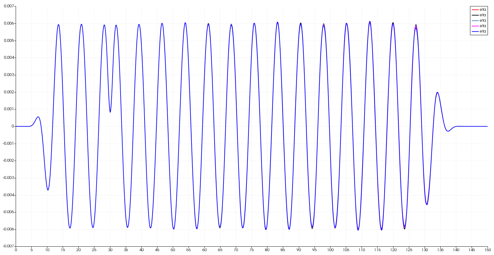

# Common bugs in the code

1. [_updateSoln()_ failing in Aqua cluster [2020-09-09]](#log_bsnqM_vBugs_1)
2. [Changing from RIAV = R(NOD) to RIAV = (R(NOD) + R(NEI))/2 [2021-09-29]](#log_bsnqM_vBugs_2)
3. [Major error in RK4 time-stepping [2021-10-07] **VERY IMP**](#log_bsnqM_vBugs_3)
4. [MLS neighbour search corrected [2021-10-29]](#log_bsnqM_vBugs_4)

## Attempting
- From 2020-Sep-09 onwards, the bugs in the main code common across all branches will be noted here.
- This log file should only be updated for a branch if the bug-fix has been done in that branch.

## List of Work
- [x] Major error in RK4 time-stepping **VERY IMP**

-----------------------------------------------

## MLS neighbour search corrected [2021-10-29]

- The earlier MLS neighbour search based on FEM link-list was a little rough.

- It has three issues
	1. The MLS radius was based on the farthest node. Hence it depended on the point as seen in the meshes below. 
	
	2. The neighs of vertex nodes and side-centre nodes had difference patterns.
	3. Due to these differences between nearby points, there was minor difference in the vel calculated from these.
		- I can see some oscillations in the depResVel-X plot for Mesh1 (Blue) which is not there in Mesh2 (Red).  
		
		- However this was seen when coupled with MLPG, where the purely Bsnq based motion of the MLPG nodes seemed to develop a pattern for the Mesh1 and not for Mesh2. 
		 
		Maybe the subtle difference add up over time in the position of the particle and create this pattern hence giving wrong elevation at pure Bsnq controlled MLPG nodes as seen below.  
		For x = 1m, here Blue is Bsnq reading, Red is BQML reading with Mesh2 for Bsnq part and Black is BQML reading with Mesh1 for Bsnq part. 
		

- I have now corrected this thoroughly

- Firstly the radius is now decided based on the nearest non-self linear point. This is mostly same for all and hence all point will have same mlsrad in a constant mesh size irrespective of the mesh pattern.

- The neighour search is now done far out. 
	 
	

- To save space I introduced a new subroutine within the mlsObject of mlsModule, _setPointNSOnly_. This will only store those neighbours which have non-zero value for atleast one of phi, phiDx and phiDy. Due to this both vertex nodes and side-middle nodes have similar neighbour pattern. 
 

- I expect this to solve the issue. However when I observe the depResVel-X plots in the updated Bsnq code, I still see some oscillations in the Mesh1 (Blue) results compared to the Mesh2 (Red) results. 
	  
	This implies the oscillations arise more from the FEM soln and not from the MLS derivative or difference in MLS radius. This is because in the updated bsnq code all nodes have same radius and symmetric neighs.

- I have put bqml runs for L03R03 coupling for both Mesh1 and Mesh2 Bsnq meshes. Lets see. Maybe the meshing itself is the issue and I should instead use a different kind of mesh.

-----------------------------------------------

## Major error in RK4 time-stepping [2021-10-07] **VERY IMP**

I made a huge mistake in RK4 time-stepping. 
It was noticed while I was writing the code for interpolation of the results between time-steps using the quantities from RK4 themselves. 
**Its a mistake which was made 2 years ago!** Its showed up in the various forms actually. But I failed to recognise it.

**After the RK4 correction, a tolerance test was done for the Berkhoff shoal test using a irregular mesh to identify the abs-tol requirement for the code. Refer to [Abs-tolerance-test](./log_bsnqM_vAlgo.md#log_bsnqM_vAlgo_8) for this**

### Previously implemented approach
- I had followed [MIT-WEB](https://web.mit.edu/10.001/Web/Course_Notes/Differential_Equations_Notes/node5.html) for the RK4 time-marching.They use the following form.  

- Note that here the ki = &Delta;y and not dy/dt. Hence they do not correspond to slope of y. Instead they are the difference of y.

- I liked this approach back then because I was able to apply DirichletBC by just using the values of y and did not need the values of dy/dt.  This made it easier to couple with anything such as FNPT or any theory, as I was apply Dirichlet BC as y(n+1)-y(n) instead of the dy/dt value.

- **However this had a major un-indented consequence.**

### The problem
- The above approach of ki = &Delta;y lead to an issue with the solver.

- I identified the issue while I was working on the interpolation of results in between two time-steps using the RK4 formulation itself. Liu (2009)

- I have been running the solver with a constant absolute tolerance limit. Here the error is calculated for `r` where `r = AX-B`

- The **AX=B** system was modified in the above RK4 time-marching approach to **AX=&Delta;tB**.
	- It is evident in the code  `gRE(i)=dt*( tmpr1 + tmpr2 )` `gRPQ(i)=dt*( tmpr1 + tmpr3 )` `gRPQ(b%npt+i)=dt*( tmpr2 + tmpr4 )`

- Hence, when the abs-tol is constant, and if you change the &Delta;t, you are effectively changing the accuracy of X

- The following rough example explains this
	- Assume B is of order 1e-2, &Delta;t = 0.10, abs-tol = 1e-5, then with X (which is &Delta;y) will be of order 1e-3 with the tolerance 1e-5 exhausted at error of 1%.
	- Assume B is of order 1e-2, &Delta;t = 0.01, abs-tol = 1e-5, then with X (which is &Delta;y) will be of order 1e-4 with the tolerance 1e-5 exhausted at error of 10%. (!!! This is bad)

- The influence of this was seen in my tests of regular waves. If I take the same wave, same mesh, but reduce the time-step, I get a unnatural increase in wave-amplitude. It has been detailed in [Source function based wavemaking [2021-06-29]](./log_bsnqM_vAlgo.md#log_bsnqM_vAlgo_7)

- It was wondering if the issue is due to boundary condition in wave-making or absorbance. 
	- I tried source function based and Fourier3 based wave-making but all gave same issue. With source function based the issue of boundary condition was supposed to be elimination. Therefore the presence of error in source-type wave-mkaing pointed towards possible other errors.
	- **But alas the issue was in time-marching.**

| Comparison of surface elevation along the centreline of the domain |
| -------------- |
| Image Zoom Out |
|  |
| Image Zoom In |
|  |
| GIF Zoom Out |
|  |
| GIF Zoom In |
|  |

### Revised RK4 time-marching
- I corrected this error by following the [Wikipedia page](https://en.wikipedia.org/wiki/Runge%E2%80%93Kutta_methods)

- Here the form is changed to the following 

- In this form ki = dy/dt, i.e., each of k1, k2, k3, k4 are slopes of y. This is shown well in the schematic from Wikipedia 

- The final `(k1 + 2k2 + 2k3 + k4)/6` is the effective slope between time-step n and n+1.

- Here the nature of **AX=B** is not altered when I change &Delta;t, because time-step is nowhere in the solver formulation. 

- Also the abs-tol will correspond to accuracy of X = dy/dt. Hence irrespective of the &Delta;t, the accuracy of dy/dt will remain the same if abs-tol is same.

- This can be seen in the same regular wave test. Earlier I was seeing a artificial increase in amplitude for smaller time-steps. But  now no such issue is seen.

### New results

Folder: Test_fixRK4/new01_w04_dx20_dt010_sW1p0 etc

| SN  | Regime | h/(gT^2) | H/(gT^2) | h   (m) | T   (s)| H   (m) | L   (m) | kh | ka |
| --- | ----- | ----- | ----- | ----- | ----- | ----- | ----- | ----- | ----- |
| 3 | Stokes2 | 1.5079 e-2 | 0.181 e-3 | 1.00 | 2.6000 | 0.0120 | 7.3320 | 0.8570 | 0.5142 e-2 | 

| Setup | dx  | dt  | Courant | L/dx | T/dt | Source fnc 'n' | Color | Remark |
| ----- | --- | --- | ------ | ------ | ------ | ------ | ------ | ------ |
|   |   |   |   |   |   | width = n\*L/2 |   |   |
| 0  | 0.20 | 0.05000 | 0.78 | 36.66 |  52 | 1.0 | black | Previous wrong time-marching |
| 1  | 0.20 | 0.05000 | 0.78 | 36.66 |  52 | 1.0 | red | Overlapping setups 1,2,3,4 |
| 2  | 0.20 | 0.02000 | 0.31 | 36.66 |  130 | 1.0 | light blue |  Overlapping setups 1,2,3,4 |
| 3  | 0.20 | 0.01625 | 0.25 | 36.66 | 160 | 1.0 | pink | Overlapping setups 1,2,3,4 |
| 4  | 0.20 | 0.01000 | 0.16 | 36.66 | 260 | 1.0 | dark blue | Overlapping setups 1,2,3,4 |

| Comparison of surface elevation along the centreline of the domain |
| -------------- |
| Image Zoom Out |
|  |

### References

1. L. Liu, X. Li, and F. Q. Hu, “Non-Uniform Time-Step Runge-Kutta Discontinuous Galerkin Method for Computational Aeroacoustics,” in 15th AIAA/CEAS Aeroacoustics Conference (30th AIAA Aeroacoustics Conference), May 2009, no. May, pp. 11–13, doi: 10.2514/6.2009-3114.

-----------------------------------------------

## Changing from RIAV = R(NOD) to RIAV = (R(NOD) + R(NEI))/2 [2021-09-29]

See MLPGR log (#log_mlpgrv01_vBugs_3) for the detailed explanation.

- I had made a mistake in understanding the support domain.
- Support domain is actually influence domain
- The spherical (assumed) influence domain of the node is the spherical region around the node where its value will have a influence
- Let say you have a point 'x' where you need to interpolate as shown in the following figure. 
- The dots are the nodes at which you have information.
- The circles are the support (influence) domain of the dots.
- The domain of dependence of 'x' will actually then be a combination of these circles. Ref. Mukherjee (1997)   
- This is true for all particle based methods such as MLS, RPIM, where the value at a position 'x' are obtained using known values at the 'dots'.
- If you check the GR Liu book for the MLS code, it is clearly seen using the radius of each 'dot' neighbour and not a radius for 'x'.  
- Therefore in all places where we do interpolation, I have changed it to RIAV = R(NEI).
- Some additional things were done in the MLPGR code, for which please refer to (#log_mlpgrv01_vBugs_3).

### List of places where edit was made

| SN  | File | Function | Description |
| --- | ---- | -------- | ----------- |
| 1 | modsMFree.f90 | mls2DDx | Changed to rj = r(nei) in two places within this function.   Also modified _weightFnc()_ to decide the weights based on dr/rj>1 etc. |
| 2 | modsMFree.f90 | testMls2DDx | Modified according to mls2DDx changes. |
| 3 | bsnqModuleFncs2.f90 | setMFree | Major changes in the influence domain radius calculation   1. Find the radius for vertices (lin node) using the farthest point in the linktable.   2. Find the radius for the edge-centres (quad nodes) using the radius of the lin nodes.   (This was necessary coz the radius for quad nodes based on farthest point in linktable would yield a very different radius compared to the lin nodes within that triangle) |
| 4 | findNeiFromLinkList.f90 | findNeiLinkList | Within this function alone I am using (rad) as a domain of dependence for the particular node.   Here rad is used a control for the neighbour search using linktable. The control condition is that if any neighbour point has distance smaller than rad then loop again. It should be alright as I am still going quite far out in the neighbour search. |
| 5 | shipMod.f90 | calcDrag | Shifted to r(nei) form. |

Verified the implementation using gradEta compared for a ship wake case with irregular mesh against the same obtained from Paraview directly.   The ship calcDrag was verified by comparing against previous results for two ships moving one behind the other.

-----------------------------------------------

## _updateSoln()_ failing in Aqua cluster [2020-09-09] [2020-09-09]
- While running the Boussinesq code in IITM's new Aqua cluster, I sometimes got segmentation fault in the first step for RK$ for the first time-step itself.
- It was quite a random error. In one example the case ran fine for 0.1s time-step and then gave a segmentation fault the exact same case when I ran with 0.05s time-step.
- On checking I found that the segmentation fault came from _updateSoln()_ subroutine.
- On deeper check it was realised the error was from the following line in each of the select case.   `b%tOb(0)%e = b%tOb(1)%e + b%gXE/2d0`
	- On commenting this line the code runs without segmentation fault
	- This is completely random as the case runs absolutely fine in Aqua for some cases and fails for some other cases.
	- I check there is no issue with allocated memory or matrix size.
	- Infact the case which gives error in Aqua runs fine in my laptop or in VSR server.
- I believe its some weird issue with the SIMD code generated by ifort for that line. 
	- Its weird that there is no issue in any of the other line in this subroutines.
- I sorted this out by changing this to a loop and put OpenMP parallel.
- After this it ran fine in Aqua.
- It was confirmed through cases rect2D and inl2B that results are identical and run-time is not effected at all. (maybe very very marginally faster)

-----------------------------------------------