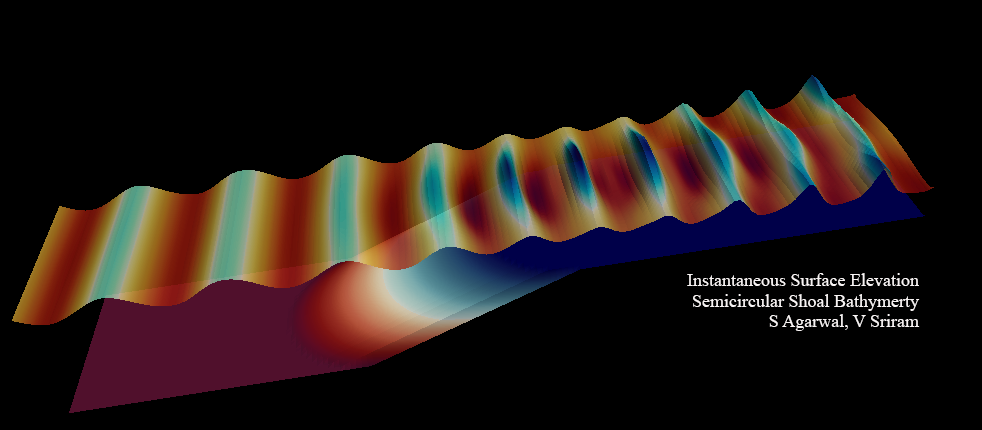

# FEM-Bsnq 
Developed at [Department of Ocean Engineering](https://doe.iitm.ac.in/)  
[Indian Institute of Technology Madras](https://www.iitm.ac.in/) 
By [Shagun Agarwal](https://shagun751.github.io/) 
Guided by [Dr V. Sriram](https://home.iitm.ac.in/vsriram/) and [Prof K. Murali](https://doe.iitm.ac.in/murali/)

#### Details

- A finite-element model based on weakly non-linear depth integrated form of Boussinesq equations as derived by Madsen. 
- The FEM formulation is based on triangular elements with mixed linear and quadratic interpolation. 
- The code is written in modern form FORTRAN, and will be checked to work with both Intel compilers and GNU compilers. 
- The FEM domain and boundary integrals in this code are calculated analytically in Mathematica. 
- The time-stepping is done using Runge-Kutta 4th order scheme.
- A modular code with object-oriented programming in mind. 
	-A module called *bsnqModule* will contain all required subroutines to be called by the user for FEM set-up and execution. 
	- A type (class) called *bsnqCase* will be used to make each case as an object. There are no global variables, in keeping with the OOPS concepts. 
	- Thus you can create multiple instances of bsnqCase to have multiple bsnq domains running in the same code, if required. 
- This modular approach will be useful in coupling this code with our other codes and will hopefully make it easier for others to contibute too. 
- Another important development is creating a general set of subrouines for calculating the FEM integrals as shown in *femAnalyticalTri_v1.0.f90*. This will slowly build up to a comprehensive list.  

The code utlised Paralution library for solving the AX=B system. [Link](https://www.paralution.com/downloads/paralution-um.pdf)

Please check the Dev-Logs for the development logs. [Link](./Dev%20-%20Logs/log_bsnqM.md)

